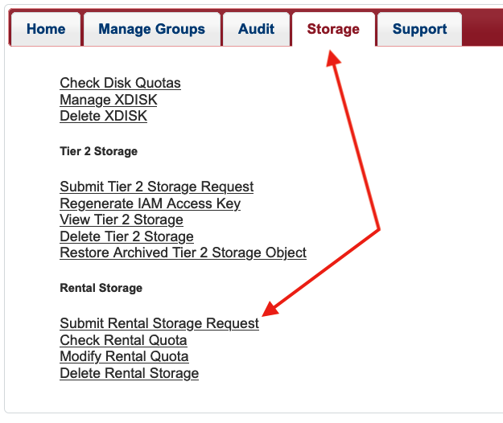
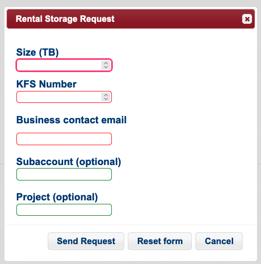
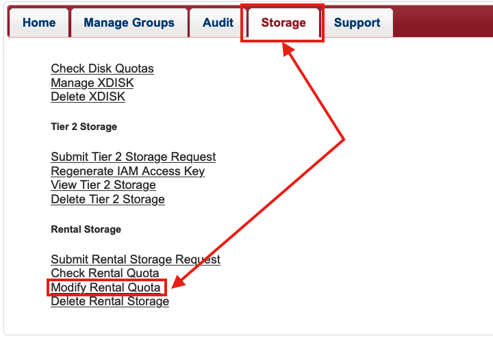
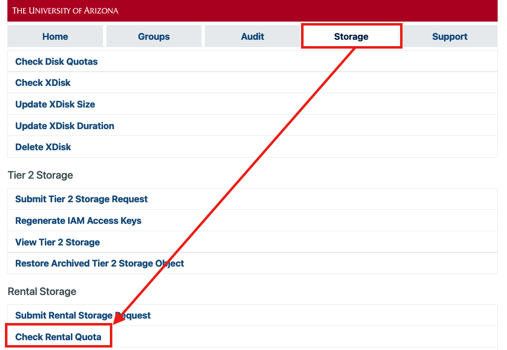
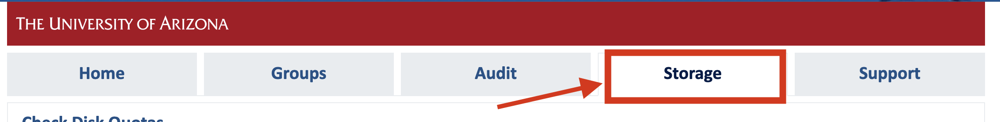
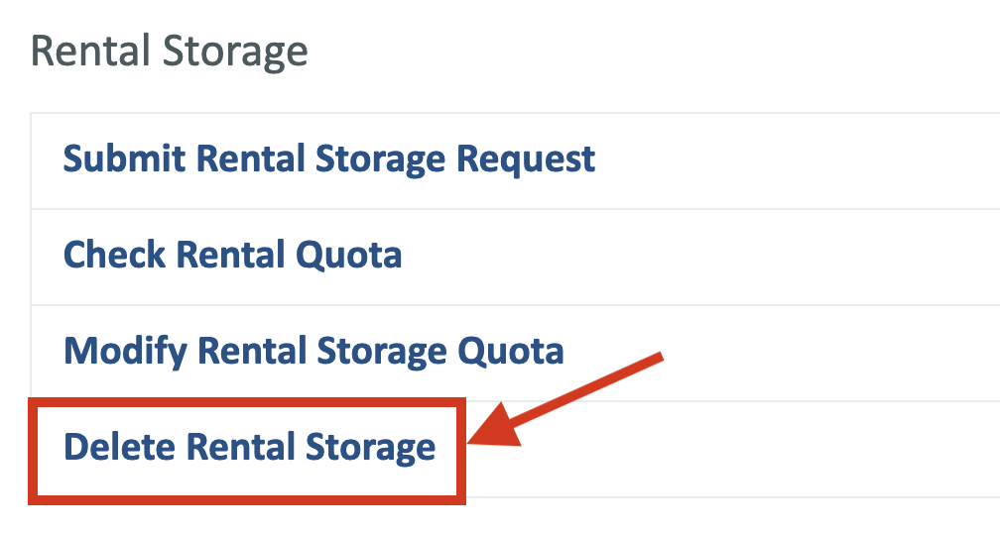
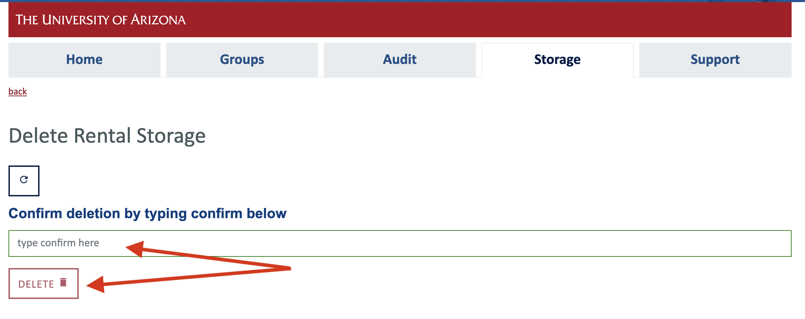

# Rental Storage

## Overview

!!! warning "No Controlled Data"
    This service is not intended for HIPAA or otherwise controlled data. Please see [Secure HPC](/resources/secure_hpc/) for more information. 

We offer a rental storage solution that has less performance and lower cost than our primary all-flash array making it affordable for research data. This storage array is located in the Research Data Center and is mounted on our data transfer nodes and compute nodes.

## Why Use Rental

1. Your capacity is not limited like `/xdisk`.
2. Your data does not expire like `/xdisk`.
3. You can use `/rental` as the primary location for your research data. We strongly recommend that you do not run your compute directly from the /rental storage due to performance limitations. See the [Best Practices](../hpc_storage) for advice on how to manage your workflow.
4. The rental rates are reasonable at $47.35 per year.
5. You can use simple commands like "cp" and "mv" to transfer data between filesystems.

## Things to Note

1. You will be billed at the end of the Fiscal Year for the maximum amount of space reserved.
2. The `/rental` filesystem is not backed up.  Snapshots are taken so we may be able to retrieve recently lost data.
3. Allocations up to 20TB in size can be requested through the user portal. For allocations larger than 20TB, [contact our consulting team](/support_and_training/consulting_services/) for help.
4. The allocation will be found in `/rental/<pi_netid>`
5. When your `/xdisk` is nearing the expiration it will be quite easy to copy your data to `/rental`. The same applies when you create an `/xdisk` to copy data in from `/rental`.
6. This storage does not have the same very high performance of the primary array, so keep in mind this is intended for longer term storage, not direct compute.  See the [Best Practices](../hpc_storage).


## Managing a Rental Allocation Through the Portal

### Requesting an Allocation

!!! tip
    It can take a few days to process the request as it has to route through the Financial Services Office (FSO). You will receive an email confirmation once it is complete.

1. PIs or [Group Delegates](../../../registration_and_access/group_management/#delegating-group-management-rights) can request rental storage on behalf of their group. To do so, navigate to the [User Portal](https://portal.hpc.arizona.edu) in your browser, choose the **Storage** tab, then select **Submit Rental Storage Request** under the **Rental Storage** heading.

    

2. This will open a web form. Add your KFS number under **KFS Number**(1) and the email address for the Department's financial contact under **Business contact email**. There will also be two optional fields: **Subaccount** and **Project**. These are used for tagging/reporting purposes in KFS billing. You can safely leave these entries blank if you're not sure what they are. Once you have completed the form, click **:material-send:**. 
    { .annotate }

    1.  A KFS number is used for accounting purposes and used by your Department's finance specialist. If you do not know your KFS number, contact your department's financial office. 

    

3. Once your space has been created, you will receive an email notification that it is ready for use.


### Resizing Your Allocation

!!! warning
    Resizing allocations up to 20TB can be done the user portal. For allocations larger than 20TB, [contact our consulting team](../../../support_and_training/consulting_services/) for help.

Your rental allocation can be resized through the user portal by navigating to the **Storage** tab and selecting **Modify Rental Quota** under the **Rental Storage** heading.


    

### Checking Your Usage

You can check your allocation's size and current usage either through the user portal or on the command line.

=== "User Portal"
    In the [user portal](https://portal.hpc.arizona.edu/portal/), navigate to the **Storage** tab and select **Check Rental Quota** from under the **Rental Storage** heading. This option is only available to PIs and group delegates.

    

=== "Command Line"
    From an HPC login node or on a filexfer node, enter the command `uquota`, for example:
    ```
    [user@local_machine ~]$$ ssh netid@hpc.arizona.edu
    [netid@gatekeeper ~]$ shell
    (puma) [netid@wentletrap ~]$ uquota
                                            used  soft limit  hard limit
    /groups/pi                                163.4G      500.0G      500.0G
    /home                                      13.2G       50.0G       50.0G
    /rental/pi                                 11.8G      931.3G      931.3G
    /xdisk/pi                                   9.0T        9.9T        9.9T
    ```

### Deleting Your Allocation

PI's can submit a deletion request to remove their rental storage through our [user portal](https://portal.hpc.arizona.edu).

{==Prior to submitting a deletion request==}, you **must**:

1. Create a backup of any data you need to keep.
2. Delete the data stored in your `/rental` space. 

After completing the steps above, you may submit a deletion request by following the steps below: 

1. Go to [portal.hpc.arizona.edu](https://portal.hpc.arizona.edu) and navigate to the **Storage** tab.

    

2. Scroll down to the section **Rental Storage** and click **Delete Rental Storage**.

    

3. In the page that opens, type **confirm** in the box that says **type confirm here** to confirm your deletion request. Once you have confirmed, click **DELETE**.

    

Submitting a deletion request will open a ServiceNow ticket and will initiate the process of deleting your rental space and the cancellation of any automatic renewal charges to your account. The ticket will be closed and you will be notified when the process is complete.
