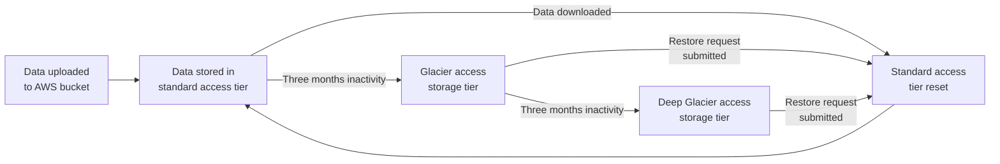
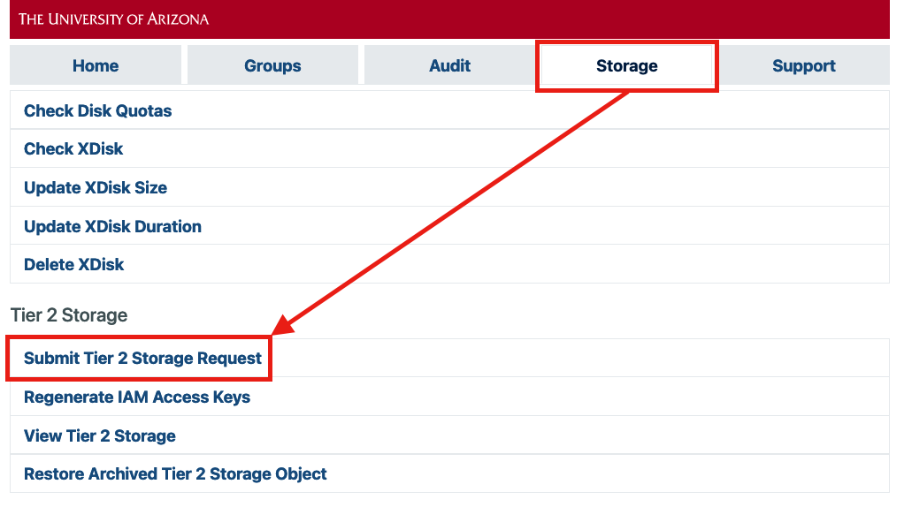
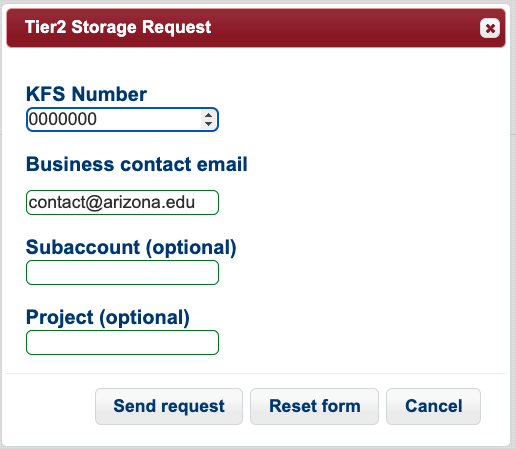
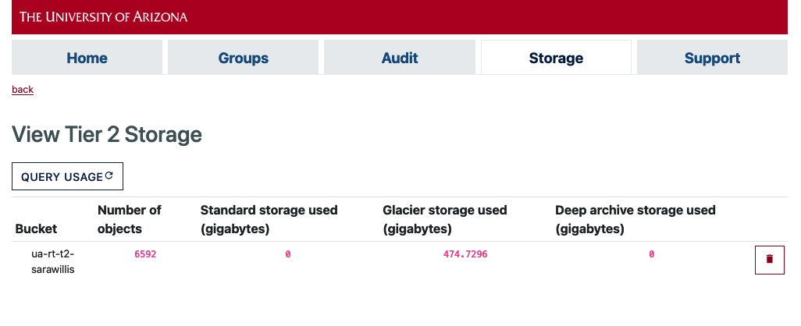
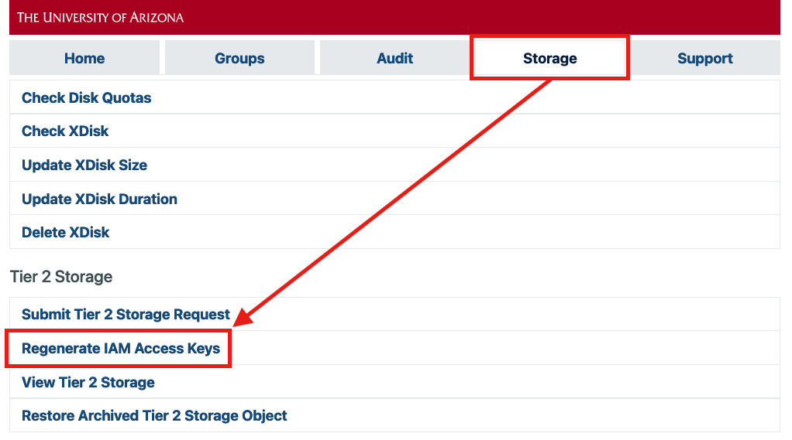
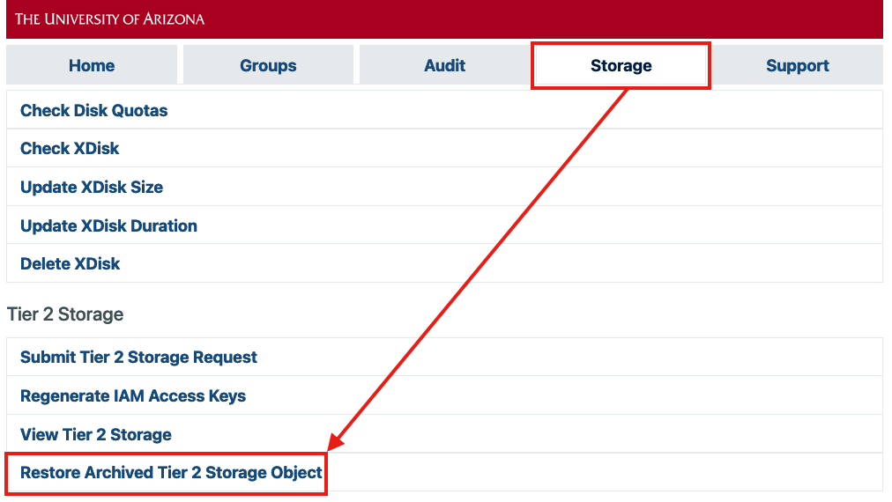
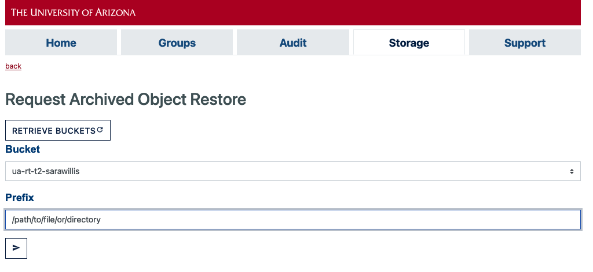

# Tier 2 AWS Storage

## Overview

!!! warning "No Controlled Data"
    This service is not intended for HIPAA or otherwise controlled data. Please see [Secure HPC](/resources/secure_hpc/) for more information. 

Research Technologies in partnership with UITS has implemented an AWS rental storage solution. This AWS option is called Tier 2 which differs from Tier 1, the primary storage that is directly connected to the HPC clusters. Tier 1 is very fast, very expensive, and immediately available for active analyses. Tier 2 is intended for archival data not immediately undergoing active analyses and for backups (highly encouraged!). Researchers can use the software Globus to move data to Tier 2, and can also move data from other sources (called endpoints). The data in Tier 2 will not be mounted on HPC, and so Globus will be used to move it back to Tier 1 if needed.

AWS storage is organized in "buckets." One S3 intelligent tiering bucket is supported per KFS account. A PI could sponsor multiple buckets by submitting separate requests each with a unique KFS number, and then provide permissions as they see fit. 


## Data Lifecycle

!!! danger "Avoid large numbers of files"
    Because AWS is set up for automatic archiving, files are moved into tiers where restore requests need to be submitted for each individual file that needs to be downloaded after a period of time. {==*We **strongly** recommend archiving directories (.zip, .tar.gz files, etc) prior to moving them to AWS.*==} This will significantly speed up your data transfers as well as reduce the complexity of file restorations. If you transfer hundreds or thousands of files to AWS, restore requests may take days or weeks to process. 

!!! warning "Small files"
    Warning: Very small files (less than 128KB ) are not subject to intelligent tiering and are not migrated to Glacier/Deep Glacier. This means they are permanently stored in the paid storage class. If you have many small files, we recommend making archives of your directories (.tar.gz, .zip, etc) prior to uploading them to AWS. This will also reduce transfer times significantly. 

Tier 2 AWS buckets use intelligent tiering to determine the archival status of files. When data are first uploaded to a group's bucket, they are in the standard access class. This essentially means they are stored on higher performant storage and are available for immediate download. After three months of inactivity(1), data are automatically migrated to Glacier storage. This is less performant and data are no longer instantly downloadable. Users will need to request a restore before downloading their files. Restore requests can be submitted either in the user portal or using a command line tool available on our compute nodes (more details below).
{ .annotate }

1.  Activity in this context means the user has interacted with the file in some way, e.g. by downloading. 


After three months of inactivity in the Glacier access tier, data are automatically migrated to Deep Glacier. Deep Glacier utilizes very slow storage technology and requires a restore request to be submitted prior to downloading files, similar to Glacier. Deep Glacier restore requests typically take more time than Glacier files. 



## Pricing

### Storage Costs

Part of this service is paid for by researchers and the rest is either subsidized or covered by UITS. The data stored in S3 will be billed monthly by AWS to the KFS account used when this is set up. Data in archival storage will be stored at no cost to the researcher. You will receive an email with detailed billing information when charges are made to your account.

|Tier|Cost to Researchers|Duration|Data Retrieval|
|-|-|-|-|
|Standard|\$0 (First TB)<br>\$23/TB/Month[^2] (data $>$ 1 TB)|Three months (if data not downloaded). After three months, untouched data automatically migrate to Glacier.|Data may be immediately downloaded.|
|Glacier|$0|Three months (if data not downloaded*). After three months, untouched data automatically migrated to Deep Glacier.|A restore request must be submitted. Restores may take a few minutes to hours. Data may be transferred once restored.|
|Deep Glacier|$0|Unlimited (if data not downloaded)|A restore request must be submitted. Restores may take a few hours to days. Data may be transferred once restored.|

### Data Transfer Costs
Data movement costs are subsidized by UITS, researchers are not charged any AWS transfer fees.


## Request a Bucket
!!! question "Who can submit a request?"
    A group's PI is responsible for submitting a storage request unless they have [a group delegate](/registration_and_access/group_management/#delegating-group-management-rights) who may submit requests on their behalf.

First, log into the [User Portal](https://portal.hpc.arizona.edu/portal/) and navigate to the Storage tab at the top of the page. Select **Submit Tier 2 Storage Request**.



This will open a web form. Add your KFS number under **KFS Number**(1) and the email address for the Department's financial contact under **Business contact email**. There will also be two optional fields: **Subaccount** and **Project**. These are used for tagging/reporting purposes in KFS billing. You can safely leave these entries blank if you're not sure what they are. Once you have completed the form, click **Send request**. 
{ .annotate }

1.  A KFS number is used for accounting purposes and used by your Department's finance specialist. If you do not know your KFS number, contact your department's financial office. 



Submitting this form will open a ServiceNow ticket. Processing time may take up to a few days. Once your request has been completed, you will receive a confirmation email with a link to subscribe for account alerts (e.g., notifications for a sudden spike in usage). 


## Checking Your Usage
!!! tip 
    AWS runs a batch update every night with the results being reported the following day. This means that if you have made any modifications to your allocation, your usage information will not be accurately reflected until the next batch update. 
    
=== "User Portal"
    You may check your storage usage at any time in the [User Portal](https://portal.hpc.arizona.edu/portal/). Navigate to the **Storage** tab, select **View Tier 2 Storage**, and click **Query Usage**.
    
    
    
    To view the size and storage classes of individuall objects, you will need to use the CLI interface.
=== "CLI"
    A command line tool is available on our compute nodes that will allow you to view the size and storage classes of the contents in your bucket. You will need to generate access keys to use this tool (see the next section). This can be accessed using:
    ```bash
    (elgato) [netid@junonia ~]$ interactive
    [netid@cpu37 ~]$ module load contrib ; module load bjoyce3/sarawillis/tier2-viewer
    ```
    For information on usage:
    ```bash
    tier2-viewer --help
    ```
    To play a tutorial in your terminal, use:
    ```bash
    tier2-viewer --example
    ```
    
## Generate Access Keys    
Access keys will allow you to connect your AWS bucket using tools such as Globus which will enable you to make transfers directly between HPC and your Tier 2 storage allocation. Access keys should be treated as passwords and should only be shared with trusted group members and collaborators. 

To generate an access key, log into the [User Portal](https://portal.hpc.arizona.edu/portal/), navigate to the **Storage** tab, and select **Regenerate IAM Access Key**.



This will generate a **KeyID** and **Secret Access Key** used to establish the connection. Save these keys somewhere safe since **once the window is closed, they cannot be retrieved**. If you forget your keys, you can regenerate a new pair.


## Transferring Files

The easiest way to transfer files from AWS to HPC is using Globus. We have instructions in our [Transferring Files](../../transfers/globus/) page on how to set up an endpoint to access your AWS bucket as well as how to initiate file transfers.

Some other file transfer programs include [rclone](../../transfers/rclone/) and [Cyberduck](../../transfers/cyberduck/).

## Restoring Archived Data

Data that are not touched for at least 90 and 180 days are automatically retiered to archival storage (Glacier and Deep Glacier, respectively). {==Files stored in an archival state cannot be transferred out of AWS until they are restored==}. Restore requests can be submitted either via the User Portal or using a command line utility available on our compute nodes. 

The time it takes for an object to be retrieved is dependent on its storage class. Objects in Glacier may take a few hours while objects in Deep Glacier may take up to a day or two. Once an object has been restored, it will move back up to the frequent access tier and can be downloaded using any transfer method you prefer.

=== "User Portal"
    !!! warning "File count"
        Warning: If you are restoring a directory, the portal will only support restore requests for directories containing up to 50 files. If you need to restore a large directory, use the CLI.
        
    In the [User Portal](https://portal.hpc.arizona.edu/portal/), navigate to the **Storage** tab by clicking **Restore Archived Tier 2 Storage Object**:
    
    
    
    This will open a box where you can enter the path to a file or directory in your bucket. Enter the path to the object you would like to restore:
    
    
    
    Once you select an object, click **Send Request** to initiate the retrieval
    
    

=== "CLI"
    A command line tool is available on our compute nodes that will allow you to view the size and storage classes of the contents in your bucket. You will need to generate access keys to use this tool. This can be accessed using:
    ```bash
    (elgato) [netid@junonia ~]$ interactive
    [netid@cpu37 ~]$ module load contrib ; module load bjoyce3/sarawillis/tier2-viewer
    ```
    For information on usage:
    ```bash
    tier2-viewer --help
    ```
    To play a tutorial in your terminal, use:
    ```bash
    tier2-viewer --example
    ```
    The ```--restore``` flag can be used to either restore a file or a full directory. 


[^2]: More up-to-date pricing information can be found on [AWS's website](https://aws.amazon.com/s3/pricing/?nc=sn&loc=4).

