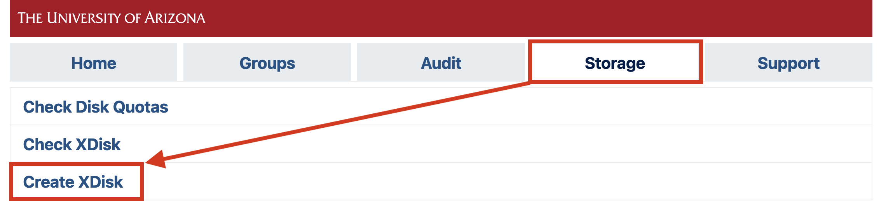
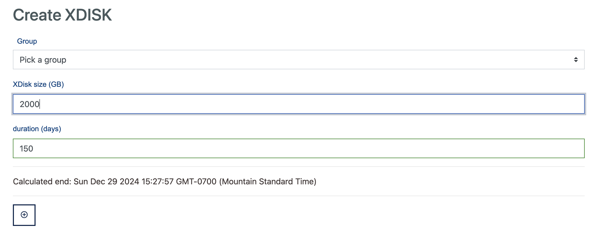
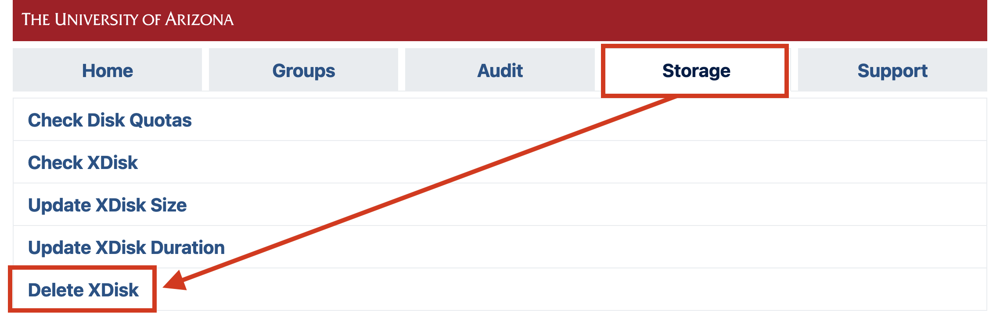
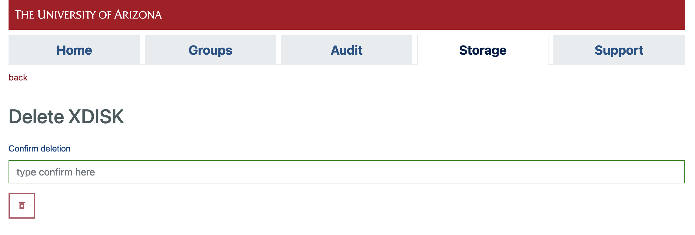
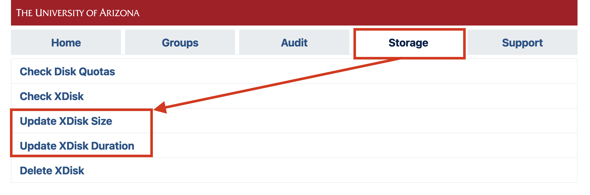

# xdisk Storage


## What is xdisk?

For groups that need more [HPC storage](../hpc_storage/) than `/groups` (500 GB limit) or `/home` (50 GB limit) can provide, faculty members (PIs) or their [delegates](../../../registration_and_access/group_management/#delegating-group-management-rights) may request a {==**temporary**==} project space for their group called xdisk. This option grants research groups up to 20 TB of additional HPC storage for a maximum duration of 300 days. 

Groups requiring long-term storage without an expiration date should consider our [rental storage offerings](../rental_storage/) instead.


## At a Glance

<div class="grid cards" markdown>

- :material-timer-sand: __Storage Type__

    Temporary project space

- :material-clock-time-eight-outline: __Maximum Duration__

    300 days

- :material-database: __Maximum Size__

    20 TB

- :material-map-marker: __Storage Location__

    `/xdisk/<pi_netid>`

- :material-delete-clock: __Expiration__

    Allocation and associated data are deleted on the expiration date

- :material-account: __Managed By__

    Faculty members (PIs) and [authorized delegates](../../../registration_and_access/group_management/#delegating-group-management-rights)
</div>


## Allocation Lifecycle

!!! danger "Expired xdisk allocations are deleted"

    xdisk allocations expire after 300 days and all associated data are deleted.

    Review the allocation lifecycle below before requesting an allocation.

1. **Allocation is created**

    The group's PI or delegate [creates an allocation](#requesting-an-xdisk).

2. **Warning emails start**

    30 days before an xdisk expires, all group members will begin receiving reminder emails with the allocation's expiration date.

3. **Allocation expires**

    Once an allocation expires, {==**all associated data are deleted**==}. 

     It is the group's responsibility to back up or move any files they wish to keep before the expiration date.

     Allocations may also be [deleted manually](#deleting-an-xdisk) prior to expiration.

4. **New allocation may be requested**

    Once an allocation has been removed, the group's PI or delegate may request a new xdisk allocation immediately, if desired.

## Backup Options

Because xdisk is temporary, groups should plan their data migration early, especially for large datasets.

Options include local or lab storage, external hard drives, cloud options, or any other approved storage services satisfying your project's data handling requirements. 

For groups looking for alternatives, HPC provides several long-term storage offerings. See our [storage overview](../overview/) page for a summary of our officially supported services.

For moving data, see our [file transfers](../../transfers/overview/) documentation, including [best practices](../../transfers/overview/#best-practices) for improving transfer performance.

One of our biggest recommendations we have for backing up large xdisk allocations is [compressing files](../../../support_and_training/cheat_sheet/#compression-and-archiving) prior to transferring them. This can speed up the process by orders of magnitude, especially when backing up many files. 

## Why is xdisk Temporary?

xdisk is hosted on our high-performance storage system, a shared 2.5 PB all-flash array designed to support active research workloads. This storage provides substantially higher performance than traditional disk-based systems, but it is also a finite and expensive resource.

Experience has shown that when storage allocations are allowed to persist indefinitely, large amounts of inactive data accumulate over time. This reduces the capacity available for active projects and can ultimately limit access to high-performance storage for the researchers who need it most.

To ensure fair access and maintain adequate free space on the system, xdisk allocations are limited to 300 days. This policy encourages groups to periodically review their data, remove files that are no longer needed, and move long-term data to more appropriate storage solutions.

Groups may request a new xdisk allocation immediately after a previous allocation has expired or been removed. The intent is to support active research storage needs while ensuring this shared resource remains available to the broader research community.

## xdisk Management

[User Portal](https://portal.hpc.arizona.edu/portal/){ .md-button .md-button--primary }

### Requesting an xdisk

PIs or delegates can request an xdisk allocation at any time through the [**user portal**](https://portal.hpc.arizona.edu/portal). On that page, under the **Storage** tab, select **Create XDisk**
    

    
This will open a web form where you can enter your size and duration requirements in GB and days, respectively. The maximum size that can be requested is 20000 GB and the maximum duration is 300 days. In addition, specify the desired group ownership for the allocation from the **Group** dropdown menu. This determines file permissions and access.
    


Once you click :material-plus-circle-outline:, the allocation is created and immediately available.

### Deleting an xdisk

PIs or delegates may delete their xdisk allocation at any time through the [**user portal**](https://portal.hpc.arizona.edu/portal). On that page, under the **Storage** tab, select **Delete XDisk**
    

    
Clicking this link will open a window with a prompt. Type **confirm** and then select :material-trash-can: to complete the process.
    

    
If you would like to request a new xdisk, you may do so as soon as the request is processed. Note: sometimes processing the request can take a few minutes, depending on the number of files and the size of the allocation.

### Modifying an xdisk

!!! warning "Xdisk allocations cannot be modified to exceed the 20000 GB or 300 day limits"

PIs or delegates may manage their xdisk allocation at any time through the [**user portal**](https://portal.hpc.arizona.edu/portal). On that page, under the **Storage** tab, either select **Update XDisk Size** or **Update XDisk Duration**, depending on the property you would like to modify.
    

    
### CLI Commands (PIs only)

!!! warning
    The xdisk CLI commands are usable by PIs only. Group delegates can manage allocations via the [user portal](https://portal.hpc.arizona.edu/portal/) after switching to their PI's account.
    
`xdisk` is a locally written utility for PI's to create, delete, resize, and extend xdisk allocations. Any PIs who wish to utilize the CLI to manage their allocations can do so using the syntax shown below:

|xdisk Function|Command|Examples|
|-|-|-|
|Display xdisk help|<pre><code>xdisk -c help</code></pre>| <pre><code>$ xdisk -c help</code></pre>|
|View Current Information|<pre><code>xdisk -c query</code></pre>|<pre><code>$ xdisk -c query<br>XDISK on host: ericidle.hpc.arizona.edu<br>Current xdisk allocation for &#60;pi_netid&#62;:<br>Disk location: /xdisk/&#60;pi_netid&#62;<br>Allocated size: 200GB<br>Creation date: 3/10/2020 Expiration date: 6/8/2020<br>Max days: 45    Max size: 1000GB</code></pre>|
|Create an xdisk|<pre><code>xdisk -c create -m [size in gb] -d [days]</code></pre>|<pre><code>$ xdisk -c create -m 300 -d 30<br>Your create request of 300 GB for 30 days was successful.<br>Your space is in /xdisk/&#60;pi_netid&#62;</code></pre>|
|Extend xdisk Expiration Date|<pre><code>xdisk -c expire -d [days]</code></pre>|<pre><code>$ xdisk -c expire -d 15<br>Your extension of 15 days was successfully processed</code></pre>|
|Resize an xdisk Allocation|<pre><code>xdisk -c size -m [size in gb]</code></pre>|<pre><code>$ # Assuming an initial xdisk allocation size of 200 gb<br>$ xdisk -c size -m 200<br>XDISK on host: ericidle.hpc.arizona.edu<br>Your resize to 400GB was successful<br>$ xdisk -c size -m -100<br>XDISK on host: ericidle.hpc.arizona.edu<br>Your resize to 300GB was successful</code></pre>|
|Delete an xdisk Allocation|<pre><code>xdisk -c delete</code></pre>|<pre><code>$ xdisk -c delete`<br>Your delete request has been processed</code></pre>|


## Viewing Storage Usage

Users may view their xdisk usage when connected to HPC on the command line by typing `uquota`. For example:

```bash title="uquota usage"
(puma) [netid@junonia ~]$ uquota
                                            used  soft limit  hard limit
/groups/pi_netid                          213.7G      500.0G      500.0G
/home                                      14.5G       50.0G       50.0G
/xdisk/pi_netid                             4.4T       19.5T       19.5T
```

## Default Directory Structure and Permissions

### Default Structure

xdisk creates a shared directory for each group at:

```
/xdisk/<pi_netid>/
```

Each existing group member receives their own subdirectory when the allocation is created :

```
/xdisk/<pi_netid>/<netid>/
```

Users added to the group after the allocation is created will not automatically receive a directory. To create a directory for a new user, [contact HPC support](../../../support_and_training/consulting_services/).

### Default Permissions

The default permissions are as follows:

- The top-level xdisk directory (`/xdisk/<pi_netid>`) is owned by the PI and cannot be modified by group members.
- Each user’s subdirectory is private (permissions `700`) and only accessible to that user.


For more information on working with shared directories and Linux file permissions, see our [File permissions](../../../support_and_training/cheat_sheet/#linux-file-permissions) and [File Management in Shared Spaces ](../../../support_and_training/cheat_sheet/#file-management-in-shared-spaces) guides.