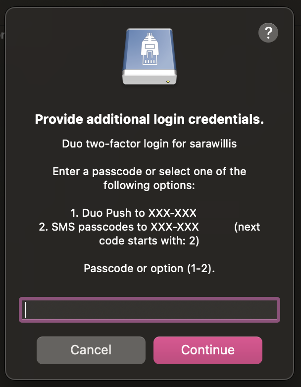
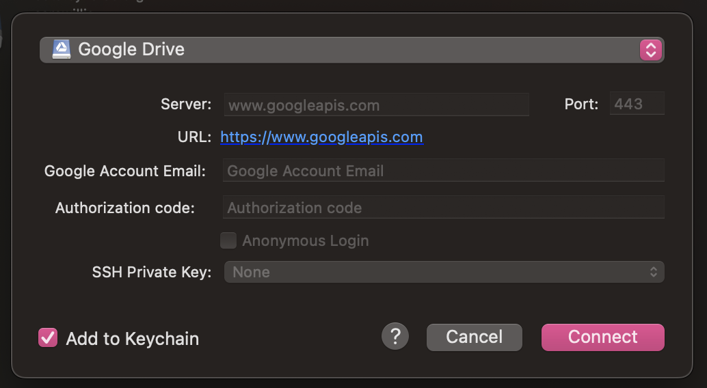
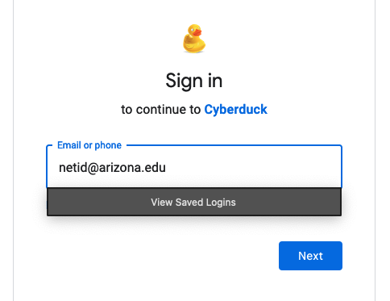

# Cyberduck

Cyberduck is a graphical file transfer application that can be used to connect to and transfer files between your local computer and various remote servers and cloud storage services. To get started, you can download the application onto your local workstation from their website here: [https://cyberduck.io/](https://cyberduck.io/)

## Initiating Transfers

Once you have Cyberduck installed, open the software and select New Browser from the toolbar


In the window that opens, select **Open Connection**


This will give you a number of options to choose from.

## Some Connection Options 

=== "HPC"
    To connect to HPC, select **SFTP (SSH File Transfer Protocol)** from the top dropdown, enter ```filexfer.hpc.arizona.edu``` under **Server**, and your university credentials under **Username** and **Password**.
    
    
    
    Once you click Connect, you will be prompted to duo-authenticate
    
    
    
    If your connection is successful, you will see a window open with the contents of your home directory.
    
    

=== "Google Drive"
    To connect to Google Drive, select the **Google Drive** option from the dropdown tab and select **Connect**
    
    
    
    This will open a browser where you will be prompted to log into your Google Drive account.
    
    
    
    Once you have successfully logged in, grant access to Cyberduck where prompted. If this process is successful, you should see a connection window where you can navigate through the contents of your Google Drive.
    
    
    
To initiate transfers, simply drag and drop your files between the Cyberduck window and your local computer. If you have multiple connections open, you can also initiate transfers between two remotes by dragging and dropping files between two connection windows.
    
    