# Globus

## Overview

[Globus](https://www.globus.org/ "https://www.globus.org/") provides a graphical web application that employs GridFTP to transfer data between pre-configured endpoints. GridFTP is an extension of the standard File transfer Protocol (FTP) for high-speed, reliable, and secure data transfer. Because GridFTP provides a more reliable and high performance file transfer (compared to protocols such as SCP or rsync), it enables the transmission of very large files. GridFTP also addresses the problem of incompatibility between storage and access systems. (You can read more about the advantages of GridFTP [here](https://en.wikipedia.org/wiki/GridFTP)).

A list of endpoint names managed by HPC are shown below for reference. For more information on usage, see [HPC-Managed Globus Endpoints](#hpc-managed-globus-endpoints) below. 

|Endpoint Name|Data Storage|
|-|-|
|UA HPC Filesystems|[HPC's main storage array](../../storage/hpc_storage/) (access to home, xdisk, and groups)|
|UA Rental Storage Filesystem|[HPC rental storage](../../storage/rental_storage/)|
|Tier 2 AWS Storage|[HPC-managed AWS S3 buckets](../../storage/tier2_storage/)|
|UA HPC HIPAA Filesystems|[Soteria](../../../resources/secure_hpc/)|

## Accessing Globus
Globus can be used as a web application. To access it, navigate to [https://www.globus.org/](https://www.globus.org/). Next, click **Log In** in the upper right-hand corner

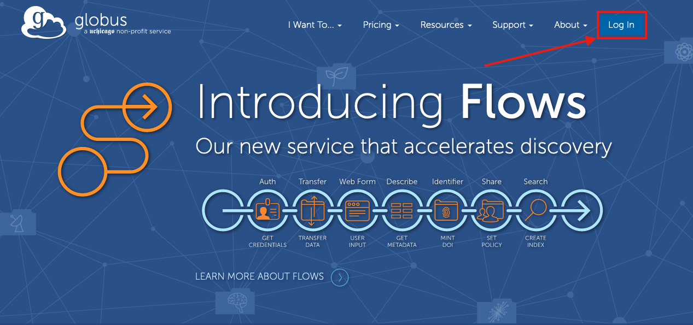

On the next page, enter **The University of Arizona** in the search field and click the result.

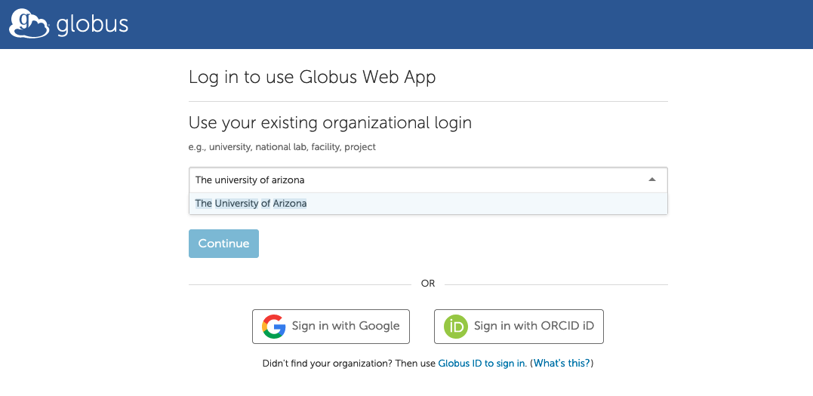

This will take you through the standard university WebAuth login process. Once you successfully log in, you will be placed in a File Manager window. The various steps for setting up endpoints, initiating transfers, and viewing a transfer's progress can be found in the sections below.

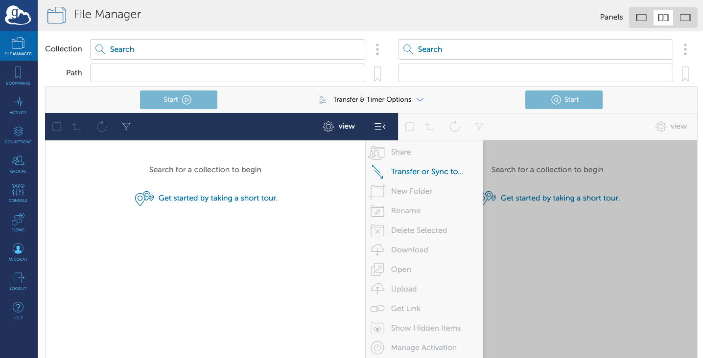


## Globus Connect Personal

To transfer files to/from your personal computer with Globus, you'll need to have a local endpoint set up. This can be achieved using Globus Connect Personal. Official documentation on how to install the relevant software and configure a local endpoint can be found in [Globus' official how-to documentation](https://docs.globus.org/how-to/). An overview is shown for Mac, Linux, and Windows below.

To start, regardless of operating system, go to [https://www.globus.org/](https://www.globus.org/), log in, navigate to the **Collections** tab, and select Get Globus Connect Personal


From there, choose your operating system to proceed with the download and setup process


=== "Mac"
    Once you've downloaded the .dmg file, open it and drag/drop the Globus icon into your Applications directory

    

    Next, open the application. This will prompt you to log in via the university WebAuth process in a browser session. Once you've logged in, enter an identifying label for your local machine and grant Globus access

    

    This will bring you back to your local Globus Connect Personal installation. You will fill out your local display name for your endpoint and click **Save**.

    


    


=== "Windows"
    Once your installation is complete, open the .exe file to initiate the install. Click **Yes** to allow Globus Connect Personal to make changes to your device
    
    
    
    Next, select the install location, and click **Install**. 
    
    

    Once the install is complete, make sure the **Run Globus Connect Personal** box is checked and click **Finish**.

    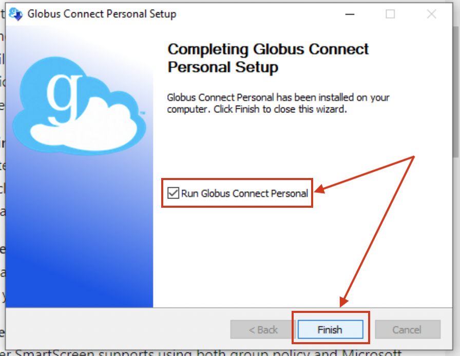


    Globus Connect Personal will then open and begin the configuration process. Click **Log In** to continue.

    

    This will open a web browser where you will go through the typical UArizona WebAuth login process. Once you're logged in, give your local endpoint a descriptive name and click **Allow**.

    

    This will bring you back to your local install. Enter a descriptive local name for your endpoint and click **Save**.

    

       

=== "Linux"
    Once your installation is complete, open a terminal, navigate to your Downloads directory, and unpack the tar archive. Next, change into the unpacked directory and execute the `globusconnectpersonal` binary:

    ```
    [user@ubuntu ~]$ cd Downloads
    [user@ubuntu Downloads]$ tar xzvf globusconnectpersonal-latest.tgz
    [user@ubuntu Downloads]$ cd globusconnectpersonal-3.2.0
    [user@ubuntu globusconnectpersonal-3.2.0]$ ./globusconnectpersonal
    ```

    This will bring up a graphical application. Click **Log In** to continue

    

    This will open a web browser where you will need to go through the typical university WebAuth process. Once you're logged in, give your endpoint a name and click **Allow**.

    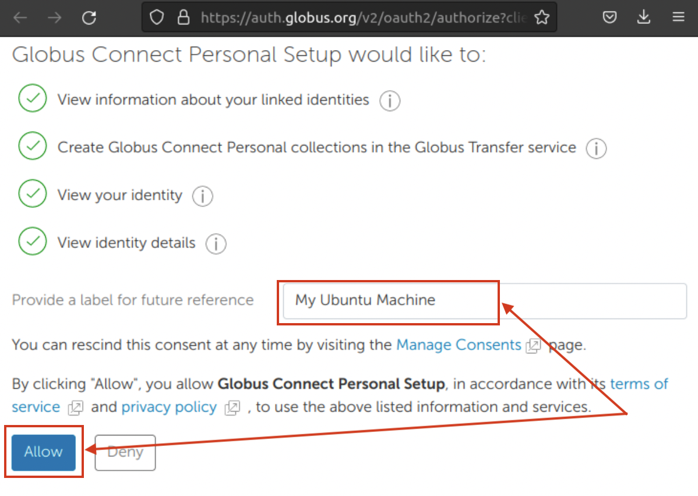

    This will bring you back to your local installation. Give your machine a descriptive name, then select **Save**.
    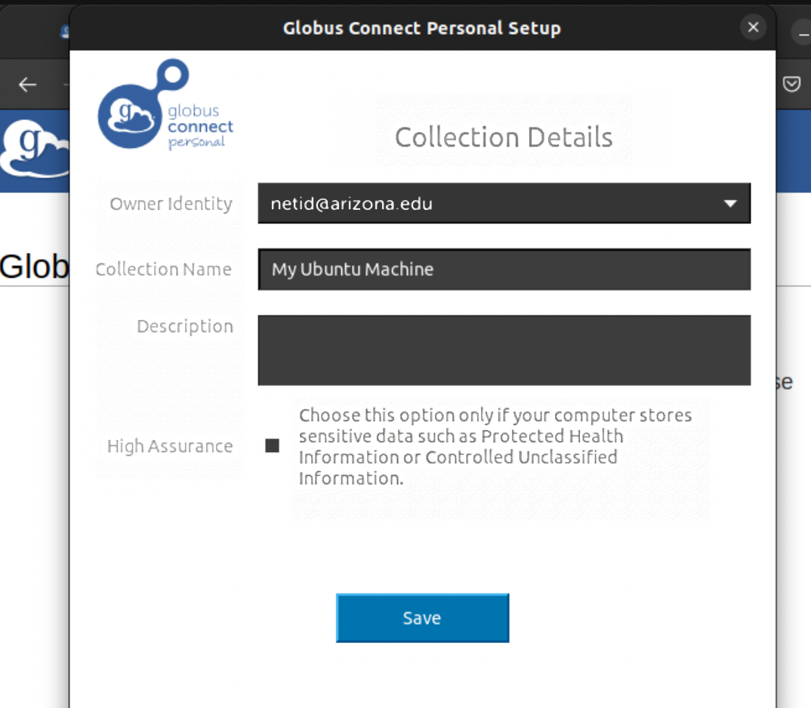  

Your setup should now be complete and your endpoint will now be usable to initiate transfers. You can find your endpoint by navigating to the **Collections** tab and checking the box **Administered by you**. For example:


    

## HPC Managed Globus Endpoints

HPC managed endpoints allow you to connect to HPC-affiliated storage to initiate transfers. Transfers can be made between any two endpoints; for example, allowing you to make transfers between your own personal computer and HPC storage, between HPC storage (`/home`, `/groups`, or `/xdisk`) and a rental option (such as Tier 2 AWS buckets or HPC rental storage), or between HPC and another institution's endpoint.

Below are a list of HPC managed endpoints and how to configure them:

=== "HPC Storage"
    The endpoint for HPC can be found by searching {==**UA HPC Filesystems**==} under the **Collections** tab.

    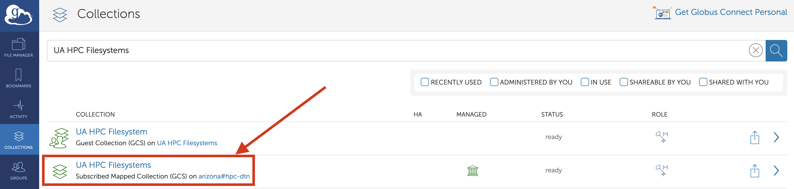
    
    Click the result, then click **Open in File Manager** to access your HPC files.

    

    The default location is your /home on HPC. You can navigate through by double-clicking directories, or by entering a full path in the **Path** search bar and hitting enter. This method can be used to access any /xdisk or /groups directories you have access to.

    
    
    


=== "Rental Storage"

    The endpoint for [rental storage](../../storage/rental_storage/) (found on the filexfer nodes under ```/rental```) can be found by searching {==**UA Rental Storage Filesystem**==} under the **Collections** tab.

    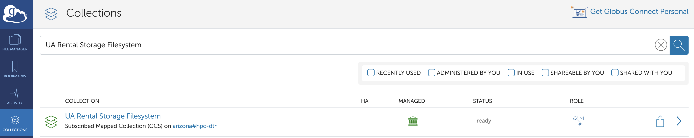

    This will open details on the endpoint. Click **Open in File Manager** to view the contents.

    

    The root for this endpoint is /rental. Faculty members who have rented storage will have a directory with their NetID in this space. Find the one relevant to you and double-click to access.

    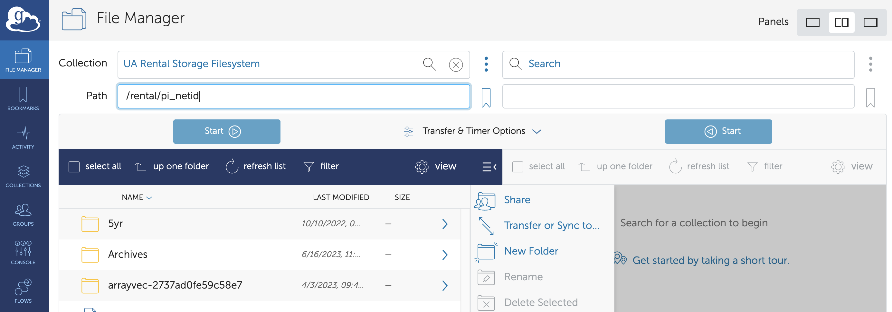

    

    

=== "Tier 2 AWS Storage"

    To access a [Tier 2 AWS S3 bucket](../../storage/tier2_storage/), in the Collections tab, enter {==**UA AWS S3**==} in the search bar. In the results, you should see the name UA AWS S3 show up with the description {==Subscribed Mapped Collection==}. Click the endpoint's name to proceed

    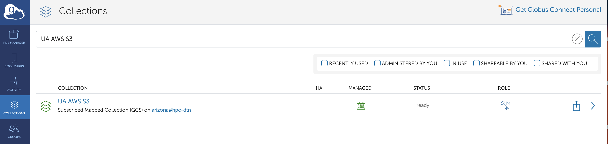

    Next, select the **Credentials** tab and select Add Credential. If you are prompted for Authentication/Consent, click **Continue**

    

    If requested, authenticate by selecting your Arizona email address, then **Allow**. You will then be returned to the Credentials tab. From there, link to your AWS S3 Bucket by entering your public and private keys in the provided fields and click **Continue**.

    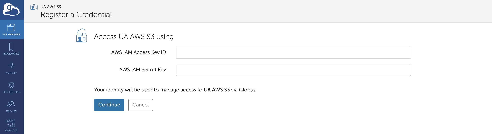

    Once you've added your keys, navigate back to the UA AWS S3 collection, go to the **Collections** tab, and click **Add a Guest Collection** on the right

    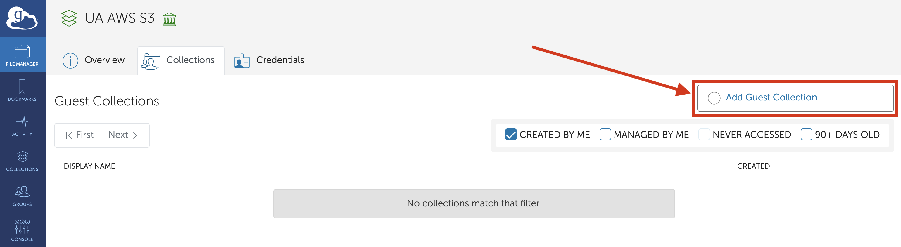

    Under Create New Guest Collection, click **Browse** next to the **Directory** field to find your group's AWS bucket. You will find it under `/ua-rt-t2-faculty_netid/` where faculty_netid is the NetID of the faculty member who requested the bucket. Under **Display Name**, enter a descriptive name that you can use to identify your bucket. Once you've completed the process, click **Create Collection** at the bottom of the page.

    !!! tip
        If you encounter Authentication/Consent Required after clicking Browse, click Continue, select your university credentials, and click Allow. That should bring you back to the Browse window.

    

    To find and use your new collection, navigate to the **Collections** tab and select the display name you assigned to your bucket. That will open your collection in the File Manager window allowing you to view the contents and initiate transfers.

    

    If you click the display name, this will open the bucket in the Globus file manager window allowing you to see the contents

    


    
    

## Making Transfers

Transfers can be made between any two endpoints of your choosing using the File Manager window in the Globus web application. In this example, we'll make a transfer between a Globus Connect Personal endpoint and the primary HPC storage array.

To start, go to the **File Manager** tab in the Globus web application. Make sure you have the dual-panel mode enabled (upper right-hand corner shown with the red arrow below) to allow you to open two endpoints. Start with opening your first endpoint by clicking the **Search** bar on the left-hand side. 


This will open a window where you can search for your first endpoint. In this example, we'll use **UA HPC Filesystems**. Click the result.

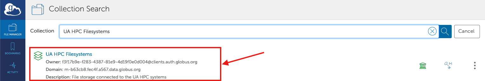

Now, on the left-hand side you should see the contents of your home directory on HPC. You can navigate through the various directories by double-clicking the folder icons, or can enter a full path in the **Path** search bar. To open a second connection, click the **Search** bar on the right-hand side. 


You can search for your next endpoint in the same way as we searched for UA HPC Filesystems. You can also find recently used endpoints and your collections (e.g., a Google Drive collection or personal endpoint) under the Recent and Your Collections tabs. In this example, we'll go to Your Collections, find a personal endpoint, and click the result. 


Now you should be back in the File Manager window with two endpoints open. A transfer can be made from one endpoint to another by selecting the item(s) you want to transfer, then clicking the Start button.

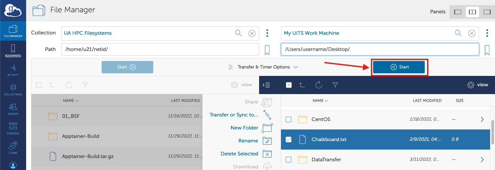


## Monitoring Your Transfers

When you initiate a transfer following the instructions in the Making Transfers section above, a green box will pop up confirming the request. 


You can get additional information the Activity panel on the left-hand side of the page. This will show you active and past transfers as well as their status. You can view additional details about your transfers by clicking the > shown on the right-hand side next to the target task. You can also cancel a transfer by clicking the × on the right. 


Once your transfer has completed, you should receive an email with its status.
