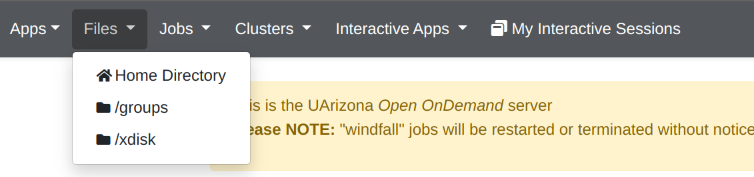
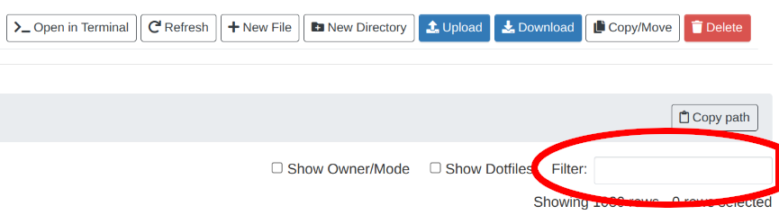

# Open OnDemand

!!! tip
    Open OnDemand file transfers are limited to 64 MB. For larger files, see [our data transfer overview](../overview/) for more options.

A popular method of transfering files to and from the HPC is the Open OnDemand interface, which is accessed through the browser at [ood.hpc.arizona.edu](ood.hpc.arizona.edu). 

To access the file browser in Open OnDemand, choose your desired share from the "Files" dropdown menu.



From there, you should see a list of folders and files. Click on folders to open them up, or use the file path navigator to ascend the tree. 


Additional actions can be taken using the button ribbon on the top right. 


To change the root directory, use the links on the left hand side of the screen. 


When navigating to your group's share within ```/groups``` or ```/xdisk```, use the "Filter" box to quickly find your folder from the list.


