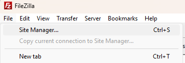
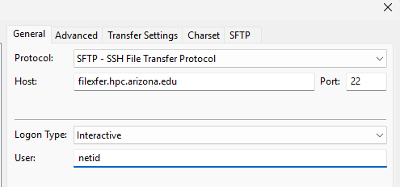
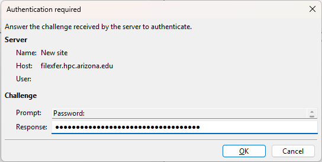
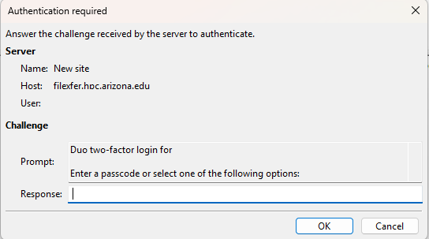
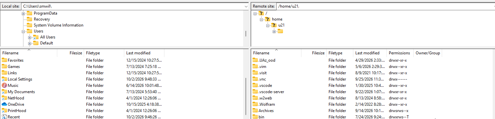

# SFTP/FTP/LFTP

!!! tip
    To use SFTP/LFTP, you will need to be connected to our file transfer nodes, hostname: `filexfer.hpc.arizona.edu`.

## SFTP

SFTP (Secure File Transfer Protocol) ensures data encryption during transmission over the network. It offers features such as resuming interrupted transfers, directory listing, and remote file management.

To perform file transfers using SFTP, you'll need an SSH v2 compliant terminal. To connect to HPC's data transfer nodes, run:

```bash
sftp your_netid@filexfer.hpc.arizona.edu
```

You will then be able to move files between your machine and HPC using ```get``` and ```put``` commands. For example:

```bash
sftp> get /path/to/remote/file /path/to/local/directory ### Retrieves file from HPC. Omitting paths will default to working directories.
sftp> put /path/to/local/file /path/to/remote/directory ### Uploads a file from your local computer to HPC. Omitting paths will default to working directories.
sftp> help ### prints detailed sftp usage
```

## FTP/LFTP

!!! warning
    Due to security risks, it is not possible to FTP to the file transfer node from a remote machine, however, you may FTP from the file transfer node to a remote machine.
    

HPC uses the FTP client LFTP to transfer files between the file transfer node and remote machines. This can be done using get and put commands. To use lftp, you must first connect to our file transfer node using an SSH v2 compliant terminal:

```bash
ssh your_netid@filexfer.hpc.arizona.edu
```

Once connected, you may connect to the external host using the command ```lftp```. For example:

```bash
lftp ftp.hostname.gov
```

You will then be able to move files between HPC and the remote host using ```get``` and ```put``` commands. For example:

```bash
> get /path/to/remote/file /path/to/local/directory ### retrieves file from remote host
> put /path/to/local/file /path/to/remote/directory ### Uploads file from HPC to remote host
```


## Filezilla

Filezilla is an FTP/STFP graphical utility that can be used to transfer files between a user's local computer and the HPC filesystem. Instruction on how to connect are provided below.

**Step 1**: Open the Site Manager and select New Site in the window that opens




**Step 2**: In the site configuration window that opens:

1. Select **SFTP - SSH File Transfer Protocol** for Protocol
2. Enter `filexfer.hpc.arizona.edu` for Host
3. Enter `22` for Port
4. Select **Interactive** for Logon Type
5. Enter your NetID for User
6. Select OK



**Step 3**: Enter your NetID password at the prompt



**Step 4**: Duo Authenticate

In the next box that opens, enter your Duo authentication option. For example, in this case I entered `1` to send a push notification.



If everything's successful, you should now be connected and see a command style window with your local filesystem on the left and your HPC's filesystem on the right. 



To transfer files, you can simply drag and drop between the frames. To change to a different path (e.g., `/xdisk` or `/groups` from your `/home`), simply enter the path under **Remote site** and hit ++enter++