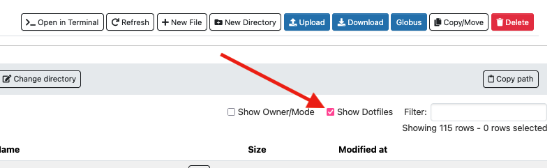
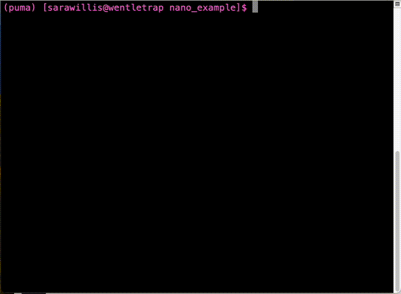
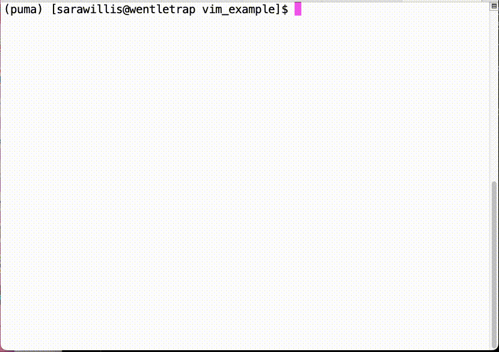

# Linux Cheat Sheet

## Why Learn Bash

Bash is a powerful command line shell that allows you to interact with our systems efficiently. It enables scripting and automation, job submission, file and directory management, remote access, resource monitoring, environment customization, parallel computing, data preprocessing, version control, error handling, software dependency management, custom workflows, and offers a valuable skill set applicable beyond HPC tasks. In other words, it allows you to do a lot!

In the cheat sheet below, we offer some basics as a reference. We also highly suggest you explore some more comprehensive guides such as the following: [Introduction to Linux on HPC](../../events/workshop_materials/intro_to_linux/)

## Shell Basics

### Shortcuts
Shortcuts can be used as stand-ins for system locations, avoiding the need for full paths. A few examples:

|Shortcut|Description|
|-|-|
|```~```|Your home directory|
|```.```|Your working directory|
|```..```|One directory above your working directory|

### Commands


|```ls```|List the contents of a directory|
|-|-|
|```ls -la```|List the contents of a directory including hidden files|
|```cd```|Change your working directory|
|```pwd```|Show the path to your working directory|
|```mkdir```|Create a new directory|
|```rm```| Delete a file. **Be careful**, files deleted this way **can't be retrieved**|
|```rm -r```|Delete a directory. **Be careful**, directories deleted this way **can't be retrieved**|

-----

## Hidden Files and Directories
Hidden files and directories start with a dot `.` and won't show up when you do a simple `ls`. [Some of these files are used to configure your environment](#configuration-files) when you first log in. Be careful when removing or modifying these files since doing so can cause unintended consequences.

Note that sometimes hidden directories can be the culprits of full home directories. Check our our [HPC storage page](../../storage_and_transfers/storage/hpc_storage/#home-directory-storage-management) for some tips on how to tackle this issue. 

Note that it's possible to see and manage hidden files and directories in the [Open OnDemand](https://ood.hpc.arizona.edu) file browser by selecting the box "Show Dotfiles"
 


-----

## Configuration Files

When you log in to an HPC system, your environment is shaped by a few special hidden files in your home directory: `~/.bashrc` and `~/.bash_profile`. These files are very important as they configure what executables you have access to, set up access to software modules, and more. 

Configuration files can be powerful tools because they let you customize your HPC experience by letting you define your own aliases and functions, set or modify environment variables, set default linux permission settings, and more. You can do this by editing the file `~/.bashrc`, and adding the commands you'd like to be executed at each login. 

Because of the critical nature of these files, it's important to be careful when editing them. A few pointers on making modifications to your configuration files are listed below:


<center>:white_check_mark: Dos :white_check_mark:</center>

* **Add useful command aliases**. This is the ideal place to add environment variables, aliases. Save time and reduce typing for common tasks:

    ```bash
    alias ll='ls -lh'
    alias extra="cd /xdisk/<your_pi>/<your_netid>"
    ```

* **Add locally-installed software to your PATH**. If you install tools in a custom directory (e.g., $HOME/bin), make them accessible automatically using something like:

    ```bash
    export PATH=$HOME/bin:$PATH
    ```

<center>:rotating_light: Don'ts :rotating_light:</center>

* **Don't delete your configuration files**. This will result in unwanted environment changes. For example, you will lose access to the `module` command. 

* **Never source your configuration files within themselves**. For example, do not add the lines `source ~/.bashrc` or `source ~/.bash_profile` to your bashrc. This sets up an infinite sourcing loop that will prevent future logins without intervention.
* **Be careful when using `echo`**. If you use CLI tools for data transfer (e.g. `scp` or `sftp`), they may require a "silent" terminal. If you're trying to initiate transfers and are getting the error "Received message too long", check your `.bashrc` or `.bash_profile` to make sure you aren't printing anything to the terminal

* **Don't alias critical commands**. For example, `.` is a shortcut for source. If you add:
    ```bash
    alias .=<command>
    ```
    you'll break the ability to load modules, activate virtual environments, and use other essential features.

-----

## Environment Variables

Bash variables control how your environment is configured. For example: what executables, libraries, header files, etc. are findable by default; information about your Slurm job; MPI settings; GPU configuration; etc. To see all the environment variables that are defined for your session, try running the command ```env```.

An example of an important environment variable is ```PATH```. This is set to a ```:```-delimited list of paths that it uses to search for executables. You can see what it's set to by running ```echo $PATH```. Any time you run a command, for example ```ls```, that list is searched in order. To add new executables to your environment, you can add a path to ```PATH```. For example:

```
export PATH=/path/to/new/directory:$PATH
```

This is what modules do: they update your environment variables to put new software and libraries into your environment for use. Some examples of some important variables are listed below:

| Variable | Function |
|----------|----------|
| `PATH`   | A colon-delimited list of paths used to search for executables. When you run a command, such as `ls`, the directories listed in `PATH` are searched in order. |
| `LD_LIBRARY_PATH` | A colon-delimited list of directories in which the linker should search for shared libraries at runtime. Useful for specifying additional library directories for dynamically linked programs. For example: `export LD_LIBRARY_PATH=/path/to/library:$LD_LIBRARY_PATH` |
| `CFLAGS`, `CXXFLAGS`, `LDFLAGS` | Environment variables used to specify compiler flags for compiling C, C++, and linking respectively. These variables are often used to customize the build process of software. For example: `export CFLAGS="-O2 -march=native $CFLAGS"` |
| `CC`, `CXX`, `FC` | Environment variables specifying the C, C++, and Fortran compilers, respectively. These variables allow users to specify which compiler should be used during the build process of software. For example: `export CC=gcc` |
| `OMP_NUM_THREADS` | Specifies the number of OpenMP threads to use for parallelized programs. This variable controls the number of threads used in parallel regions of OpenMP-enabled programs. For example: `export OMP_NUM_THREADS=4` |

[Slurm also sets its own environment variables](../../running_jobs/batch_jobs/environment_variables/).

-----

## Command Line Text Editors

When working on an HPC system, it is often more efficient to edit files directly from the command line rather than using a graphical text editor. This is especially useful when connected to a remote system via SSH. Command-line text editors allow you to quickly modify configuration files, scripts, and other documents without leaving the terminal.

There are many command-line text editors available, but two of the most commonly used are Nano and Vim, both of which are installed on our systems.

### Nano


Nano is a beginner-friendly command-line text editor with a simple interface. To open a file in Nano, use:

```bash
nano <filename>
```
Where `<filename>` is the name of the file you want to edit. If the file does not exist, Nano will create it when you save.

Once the file is open, you can start typing immediately. To navigate and edit:

* Use the arrow keys to move the cursor.
* Add or delete text as needed.
* When finished, press ++ctrl+x++ to exit.
* Press ++y++ to save changes or ++n++ to discard them.
* If saving, press ++enter++ to confirm the filename.

More detailed information on using Nano can be found in various sources online, for example [Linuxize has a how-to tutorial](https://linuxize.com/post/how-to-use-nano-text-editor/) that new users may find helpful.

### Vim


Vim is a powerful text editor with advanced features but has a steeper learning curve than Nano. To open a file in Vim, use:

```bash
vim <filename>
```
Where `<filename>` is the name of the file you want to edit. If the file does not exist, it will be created when you save.

Vim has multiple modes; the two main ones are Normal mode (for navigation and commands) and Insert mode (for editing text).

* When you first open a file, Vim starts in Normal mode.
* Press ++"i"++ to enter Insert mode and begin editing.
* When done, press ++escape++ to return to Normal mode.
* To save and exit, type `:`, then `wq`, then press ++enter++.
* To exit without saving, type `:q` if no changes were made, or `q!` to force quit (if edits were made that you wish to discard). Then press ++enter++.

For more in-depth information, Vim has an interactive tutorial you can access by running:

```bash
vimtutor
```

-----

## Linux File Permissions

Linux file permissions control who can access files and directories and what they are able to do with them.

HPC users may find it useful or necessary to share files and/or directories with collaborators. To do this effectively, it may become necessary to familiarize yourself with the linux file permission system in order to give collaborators access to your files. 

### Types of Permissions

All files and directories on a Linux system have permissions defined for them. There are three types:

|Permission|Symbol|Directory meaning|File meaning|
|-|-|-|-|
|Read|```r```|Users can view the contents of the directory|Users can read the contents of a file|
|Write|```w```|Users can modify the contents of a directory|Users can write to a file|
|Execute|```x```|Users can ```cd``` into a directory|Users can directly execute a file|

When a permission is missing, you will see a ```-```


### Viewing Permissions
To see a file or directory's file permissions, run the command ```ls -l```. This will show you output that looks like the following:

<center><code style="background-color: #faca89;">-</code><code style="background-color: #fff0bf;">rwx</code><code style="background-color: #deffbf;">r-x</code><code style="background-color: #bffff6;">---</code><code> 1 </code><code style="background-color: #fff0bf;">username</code><code> </code><code style="background-color: #deffbf;">groupname</code><code> 0 Feb 27 09:54 file</code></center>

|String|Access Group|Meaning|
|-|-|-|
|<code style="background-color: #faca89;">-</code>|Tells you whether this item is a regular file (```-```), directory (```d```), or link ```(l)```|In this example, we're looking at a regular file|
|<code style="background-color: #fff0bf;">rwx</code>|This describes the permissions that are set at the user level. In this case, they apply to the user with the username <code style="background-color: #fff0bf;">username</code>. Your username is your NetID| In this example, the file's owner can read, modify, and execute this file.|
|<code style="background-color: #deffbf;">r-x</code>|This describes the permissions that are set at the group level. In this case, they apply to anyone who is a member of the group <code style="background-color: #deffbf;">groupname</code>. To see your groups you're a member of, run the command ```groups```.|In this example, group members are allowed to see and execute the contents of this file, but they cannot modify it. 
|<code style="background-color: #bffff6;">---</code>|This describes the permissions that are set for anyone else on the system.|In this example, the rest of the HPC community can't see or edit the contents of this file and can't execute it|

### Changing Permissions

!!! tip "Permissions changes limitations"
    Only the owner of a file or directory can change its permissions. 

To change the permissions of a file or directory, you can use the command `chmod`. This command accepts two types of input: symbolic and octal.

#### Symbolic

Symbolic notation is the most intuitive to understand. It involves a comma-delimited list of permissions symbols, each representing a specific permission type (read, write, execute) for a particular user or group. Here's a breakdown of the symbols used:

|Symbol|Meaning|
|-|-|
|`u`|"User". Refers to the user who owns the file.|
|`g`|"Group". Refers to the group that the file belongs to.|
|`o`|"Other". Refers to other users who are not the owner or in the group.|
|`a`|"All". Refers to all users (`u`, `g`, and `o`).|

For each of these, you can use `+` to add a permission, `-` to remove a permission, or `=` to set the permissions explicitly. The permission symbols are: `r`,`w`, and `x` and match those described under [Types of Permissions above](#types-of-permissions).

The general syntax is

```
chmod [who][operator][permissions]
```

Here are some examples of how you might use symbolic notation with the `chmod` command:

- To give the owner read and write permissions: `chmod u+rw file.txt`
- To remove execute permissions for the group: `chmod g-x file.txt`
- To give all users read and execute permissions without write permissions: `chmod a=rx file.txt`

#### Octal

Octal notation is a more compact way of representing permissions using numbers. Each permission type (read, write, execute) is assigned a numeric value:

| Octal notation | Permission|
|-|-|
|`4` | read |
|`2` | write|
|`1` | execute|


To set permissions, you add these values together for each permission type. For example:

- Read and write permissions: `4 (read) + 2 (write) = 6`
- Execute permission only: `1 (execute)`

You then represent the permissions for the user, group, and others as a three-digit number. For instance:

- `600` gives read and write permissions to the owner and no permissions to the group and others.
- `755` gives read, write, and execute permissions to the owner, and read and execute permissions to the group and others.

To use octal notation with the `chmod` command, you specify the permissions directly as numbers. For example:

- `chmod 600 file.txt`
- `chmod 755 file.txt`

These commands will set the permissions of `file.txt` accordingly.

### Changing Group Ownership

!!! tip "Ownership changes limitations"
    Only the owner of a file or directory can change its group ownership

To change the group ownership of a file or directory, you can use ```chgrp```. For example:

```bash
chgrp groupname /path/to/file
```

### Changing User Ownership

Changing the user ownership of a file requires root permissions, even if the user owns the file they are trying to modify. If ownership modifications are needed, [contact our consulting team for assistance](../consulting_services/). 

### File Management in Shared Spaces

!!! warning "ACLs unavailable"
    Using something like `setfacl` is possible on some systems to set the default permissions for specific directories and their contents. Unfortunately, ACLs are not available on our systems due to software limitations on our file servers. Some alternatives are detailed below. 


If you're working in shared storage and want your files to be accessible to collaborators, sometimes it can be challenging to ensure those files are created with the correct group ownership and file permissions to allow access. In those cases, it might be helpful to look into setting the SGID (Set Group ID) and using the `umask` command described below.  

#### Default Group Ownership

The SGID (Set Group ID) bit can be set on a directory to ensure that files and directories created within that parent directory inherit its group ownership. This ensures that those files can be made accessible (with the proper permissions) to other members of that group.

To set the SGID bit on a directory, use the `chmod` command with the `g+s` option:

```bash
chmod g+s /path/to/directory
```

You'll notice that when a directory does not have the SGID bit set, its group permissions will look something like `rwx`. When the SGID bit is set, the `x` will become either an `s` (if group execute permissions are set) or `S` (if group execute permissions are disabled). For example:

```console
(puma) [netid@wentletrap EXAMPLES]$ ls -ld parent_directory/
drwxr-xr-x. 2 netid hpcteam 0 Sep  4 12:50 parent_directory/
(puma) [netid@wentletrap EXAMPLES]$ chmod g+s parent_directory/
(puma) [netid@wentletrap EXAMPLES]$ ls -ld parent_directory/
drwxr-sr-x. 2 netid hpcteam 0 Sep  4 12:50 parent_directory/
```

#### Default Permissions

The `umask` command controls the default file permissions for all new files and directories created {==at a user level==}. It defines which permissions should **not** be set by default, and thus indirectly determines the default permissions. 

By setting an appropriate `umask`, you can ensure that files and directories are created with the permissions that are appropriate for your collaborative environment.

To check your active umask value, you can run the command without arguments. For example, the default on our system is:

```console
(puma) [netid@wentletrap EXAMPLES]$ umask
0022
```
To make sense of this output output, take the last three digits and subtract them from either `777` (for directories) or `666` (for files). So for example, in the output shown above, `0022` means new directories will always be created with the permissions `777` - `022` = `755` which is the same as `rwxr-xr-x`. Similarly, for files: `666` - `022` = `644` which is the same as `r-wr--r--`. If you're unfamiliar with octal formatting, see [octal file permissions above](#octal) for more information on how these numbers correspond to file permissions.

To set a new `umask`, you can include arguments either in octal or symbolic format. Symbolic notation is a little more straightforward and intuitive than octal and uses the syntax 

```
umask u=<user permissions>,g=<group permissions>,o=<other permissions>
```

For example:

```console hl_lines="5"
(puma) [netid@junonia umask]$ touch test.txt && mkdir test_dir
(puma) [netid@junonia umask]$ ls -l test.txt && ls -ld test_dir/
-rw-r--r--. 1 netid hpcteam 0 Mar 30 10:24 test.txt
drwxr-sr-x. 2 netid hpcteam 0 Mar 30 10:24 test_dir/
(puma) [netid@junonia umask]$ umask u=rwx,g=rwx,o=
(puma) [netid@junonia umask]$ rm -r test.txt test_dir/
(puma) [netid@junonia umask]$ touch test.txt && mkdir test_dir
(puma) [netid@junonia umask]$ ls -l test.txt && ls -ld test_dir/
-rw-rw----. 1 netid hpcteam 0 Mar 30 10:24 test.txt
drwxrws---. 2 netid hpcteam 0 Mar 30 10:24 test_dir/
```
Note how once `umask` is set by the user, the default permissions applied to the new test file and directory allow group edit access and remove "other" access completely. The octal notation to accomplish the same result would be `umask 007`. 

Some things to keep in mind: 

* {==`umask` only affects your active terminal session and does not propagate to future sessions.==} This means if you log out and log back in, your umask will be reset to the system default. If you'd like your default file permissions to be permanently changed, you can add your `umask` command to your ~/.bashrc. For more information on this file, see [hidden files and directories](#hidden-files-and-directories) above. 

* `umask` applies to **all** new files and directories you create, so you'll want to make sure you are not inadvertently giving unwanted access to your data.

#### Sticky Bits

In shared environments with group write permissions, it's possible for users to accidentally or intentionally delete files or directories created by others. The Sticky Bit is a security feature that can help manage this issue by restricting file deletion within a directory.

The Sticky Bit, when set on a directory, ensures that only the file's or directory's owner can delete or rename them. This can be particularly useful in shared directories where multiple users need to collaborate but should not interfere with each other's files. To set the Sticky Bit on a directory, use the chmod command with the `+t` option:

```bash
chmod +t /path/to/directory
```
The change will be displayed at the end of the permissions string either as a `t` (if execute permissions are set for "other") or a `T` (if execute permissions are disabled for "other"). For example:

```console
(puma) [netid1@wentletrap EXAMPLES]$ ls -ld parent_directory/
drwxrws--T. 3 netid2 hpcteam 512 Sep  4 13:36 parent_directory/
(puma) [netid1@wentletrap EXAMPLES]$ ls -l parent_directory/
total 4
drwxrws---. 2 netid2 hpcteam 0 Sep  4 13:36 other_user
(puma) [netid1@wentletrap EXAMPLES]$ rm -r parent_directory/other_user/
rm: cannot remove ‘parent_directory/other_user/’: Operation not permitted
```

Note that although `netid1` has full `rwx` permissions set for both `parent_directory` and `other_user`, they cannot delete `other_user` because the sticky bit is set on the parent directory. Note that if `netid2` were to try to delete it, they would be successful. 

One thing to keep in mind is that the owner of the parent directory will still be able to delete the contents even if the sticky bit is set and they do not own the directory they are deleting.

## Compression and Archiving 

!!! tip
    For very large directories, use the file transfer node. Hostname: ```filexfer.hpc.arizona.edu```

Are you planning on transferring files to or from HPC? Do you have a lot of them? Then archiving is for you! 

Archiving files is the process of consolidating one or more files or directories into a single, compressed package or archive file. This simplifies data management, reduces storage space, and streamlines file transfer and backup operations. Transferring a single archived file to an external backup location my result in transfer speeds that are an order of magnitude faster than transferring the same data as an uncompressed directory with thousands (or sometimes millions) of files.

As an example, we'll use the archiving tool ```tar```. The syntax to create an archive is 
```
tar <options> <output_archive_name> <contents>
``` 

We'll use the options ```czvf``` which stands for:

* ```c```: Create a new archive
* ```z```: Filter the archive through gzip
* ```v```: Verbosely print the output of the archiving process. Optional
* ```f```: User archive file

Archiving a directory ```dir``` and its contents into a single file called ```dir.tar.gz``` then looks like:

```
(puma) [user@wentletrap archiving_example]$ tar czvf dir.tar.gz dir
dir/
dir/subdir1/
dir/subdir1/file.txt
dir/file1.txt
dir/file3.txt
dir/file2.txt
(puma) [user@wentletrap archiving_example]$ ls
dir  dir.tar.gz
```

To unpack this archive, change the ```c``` to an ```x``` which stands for "extract":

```
tar xzvf dir.tar.gz
```