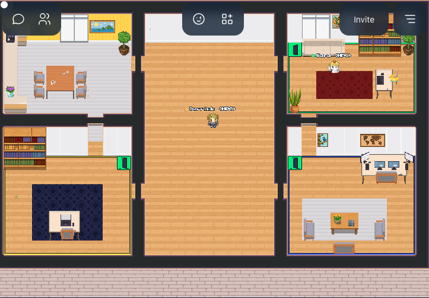

# Consulting Services

<link rel="stylesheet" href="../../../assets/stylesheets/images.css">

## HPC Consulting Services

[Contact Us](https://uarizona.service-now.com/sp?id=sc_cat_item&sys_id=2983102adbd23c109627d90d689619c6&sysparm_category=84d3d1acdbc8f4109627d90d6896191f){ .md-button }

Consulting is available free of cost to everyone and we welcome you to reach out! Our services include, but are not limited to:

* Help for new users getting started with our resources. We know using HPC systems for the first time can be intimidating so scheduling an in-person meeting where you can ask loads of questions can help a lot.
* General issues that may occur, e.g., why is my job spending so long in the queue, where can I find information on topic &#60;A&#62;, why is this strange and unexpected thing happening, etc.
* Advice on code optimization and utilizing our resources more effectively/efficiently.

??? question "When can I ask for help?"
    Any time! But first, we encourage you to:

    * Double-check our FAQs - We keep track of commonly asked questions and document their solutions. You might find what you're looking for there.
    * Look through our online documentation - There's lots of information to help get you started that may answer your question or help give you a better idea of what to ask.
??? question "How can I effectively write a support request?"
    Glad you asked! Helping us help you goes a long way and can give you better answers faster. Some general rules of thumb:

    * **Detail detail detail** A full error log may seem like a lot to send, but the more information we have, the more likely we are to be able to diagnose and/or replicate your issue.

    * **Use reply-all to email chains** 
    We will cc hpc-consult in our responses so that our [small consulting team](../people/) is able to view the issue and contribute.

    * **Provide context** There's a common support issue called [The XY Problem](http://xyproblem.info/). Say you have a problem and try to solve it yourself but the attempted solution produces an additional problem. Submitting a ticket requesting help with the attempted solution without information about the original issue can lead to more confusion. 

    * **Submit a ticket for your questions** If you reply to general system announcements or send emails to an HPC staff member's private inbox without cc'ing hpc-consult, your ticket may get lost and go unanswered. Submitting a ticket will ensure we have a record of your question and will get to it as promptly as we are able.
    
??? question "What are our support policies?"
    

    Mostly it is common sense rather than strict rules. The primary consideration is that our consultants work regular hours with some flexibility built-in. So don't expect detailed responses at night or on the weekends. You might get a quick response but don't count on it.

    Our consultants typically don't know how to run your applications unless they have broad usage like Python or R. So once we determine it is likely an issue with the code we will refer you to the provider. We don't troubleshoot bugs or run profilers, but we support tools like Valgrind for you to use.

    We don't mind you asking lots of questions. We encourage you to ask for a consulting session via Zoom or Office Hours (see below). We are not in the office so you can't drop by (although we kind of miss that personal engagement).

    The bottom line is that the supercomputers are only really productive tools when you have the support to gain the most out of them to improve both your results and the time to get results.

??? question "How can I reach HPC consulting?"
    We use ServiceNow and can be reached with [a support ticket](https://uarizona.service-now.com/sp?id=sc_cat_item&sys_id=2983102adbd23c109627d90d689619c6&sysparm_category=84d3d1acdbc8f4109627d90d6896191f). Many in our research community are accustomed to using the list service for hpc-consult. That continues to work but is not as efficient. And we really want to discourage sending emails directly to your favorite consultant.  
    
### Office Hours
{ align=right }

We host virtual, drop-in office hours every Wednesday from 2:00-4:00pm. Drop by to visit with our consultants to ask any questions you have about using HPC resources. It might be a bunch of getting started questions, or you might want to share your screen to walk us through a particular problem you're hung up on. We have private spaces for one-on-one consults. You can [join us in Gather Town at this link](https://gather.town/app/dVsAprPNBVmI9NpL/hpc-office-hours). 
 

If you have never used Gather Town before and would like additional information, [check out this page](https://support.gather.town/hc/en-us).

## Visualization Consulting 

Visualization Consulting is a service that allows researchers to create graphical representations of their data. These computer-generated images and animations allow researchers to visually analyze that data and see the results of changing specific parameters. Services include consultation, demonstration, and training for high-resolution visualization output and simulation. 

Visualization consulting can be requested by contacting **vislab-consult@list.arizona.edu**

