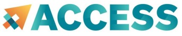
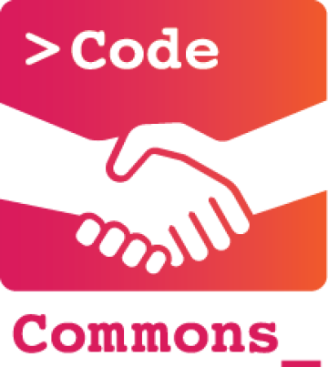
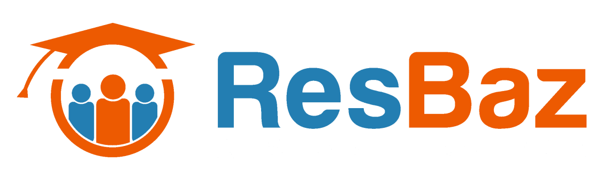
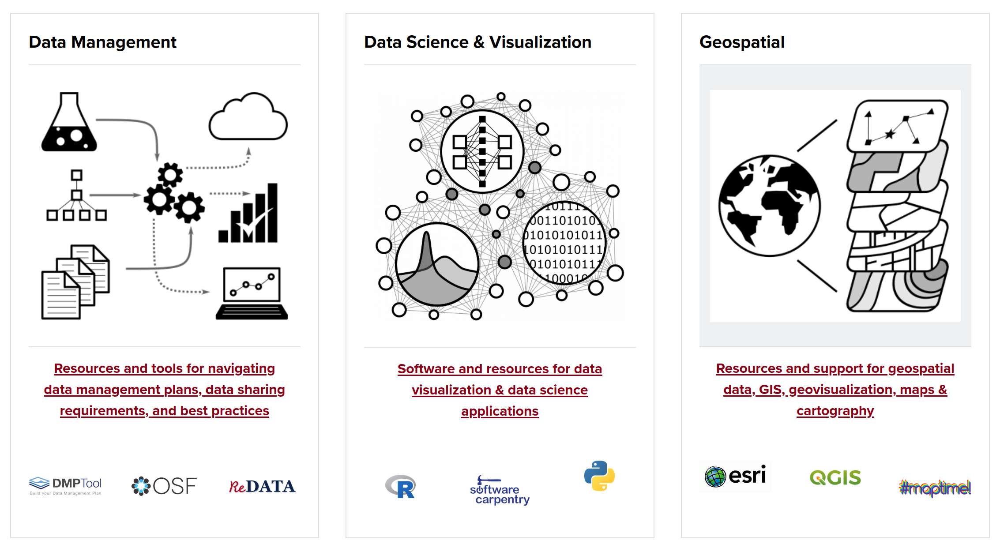

# External Resources

Explore a number of resources beyond our center's offerings, from local community events to comprehensive software support and opportunities for accessing national supercomputing clusters. We've curated a collection of external organizations aimed at enhancing your HPC journey, providing diverse avenues for support and collaboration.

## ACCESS
 

XSEDE supports 13 supercomputers and high-end visualization and data analysis resources across the country.  These are made available for use by researchers including at the University of Arizona. This program ends at the end of August 2022 to be replaced with a new program called ACCESS. This is also funded by the National Science Foundation.

The new program is going through many changes so we will just include their website while has the most current information:
[https://access-ci.org/](https://access-ci.org/).

Researchers who have current project allocations that were awarded via XSEDE –including projects awarded at the August 22 XRAC meeting – should notice no changes to their resource access after August 31. For projects that expire on December 31, the ACCESS team recommends planning to submit a proposal during the usual September 15 to October 15 submission window under the existing XRAC guidelines.

Researchers whose needs are at the smaller end of the scale should review the new [ACCESS Allocations Marketplace](https://allocations.access-ci.org/) information that is previewed on the XSEDE site pending the launch of the ACCESS site.

## Ansys
 

For help with local installations, contact the College of Engineering IT services: **support@engr.arizona.edu**

Ansys-specific support (debugging, questions about usage, etc) is available through PADT: **support@padtinc.com**

To report license connection issues, contact: [HPC consulting](../consulting_services/)

## Code Commons

 

Code Commons provides a physical space for community and collaboration. Join to share experience, learn, mentor, discover opportunities, and work on your programming projects in the presence of others doing the same. Held every Wednesday from 2:00-6:00pm at the UArizona Library in the CATalyst Data Studios. For more information, see: [https://codecommons.net/](https://codecommons.net/)

## CyVerse
 

CyVerse provides life scientists with powerful computational infrastructure to handle huge datasets and complex analyses, thus enabling data-driven discovery. Their extensible platforms provide data storage, bioinformatics tools, image analyses, cloud services, APIs, and more: [http://www.cyverse.org/about](http://www.cyverse.org/about)

CyVerse is funded by the National Science Foundation’s Directorate for Biological Sciences. They are a dynamic virtual organization led by the University of Arizona to fulfill a broad mission that spans our partner institutions: Texas Advanced Computing Center, Cold Spring Harbor Laboratory, and the University of North Carolina at Wilmington.

## Neuroimaging Core
 

Are you part of the neuroimaging community and interested in using HPC? The UArizona Neuroimaging Core has [excellent documentation](https://neuroimaging-core-docs.readthedocs.io/en/latest/pages/hpc.html) to help you get started.

## Open Science Framework
 

The OSF is a free, open source service maintained by the Center for Open Science. Here are a few things you can do with the OSF:

* **Store your files** Archive your materials, data, manuscripts, or anything else associated with your research during the research process or after it is complete.
     
* **Affiliate your projects with your institution** Associate your projects with the University of Arizona which is a member. They will be added to UArizona's central commons, improving discoverability of your work and fostering collaboration.
    
* **Share your work** Keep your research materials and data private, make it accessible to specific others with view-only links, or make it publicly accessible. You have full control of what parts of your research are public and what remains private.
     
* **Register your research** Create a permanent, time-stamped version of your projects and files. Do this to preregister your design and analysis plan to conduct a confirmatory study, or archive your materials, data, and analysis scripts when publishing a report.

* **Make your work citable** Every project and file on the OSF has a permanent unique identifier, and every registration can be assigned a DOI. Citations for public projects are generated automatically so that visitors can give you credit for your research.
     
* **Measure your impact** You can monitor traffic to your public projects and downloads of your public files.

* **Connect services that you use** GitHub, Dropbox, Google Drive, Box, Dataverse, figshare, Amazon S3, ownCloud, Bitbucket, GitLab, OneDrive, Mendeley, Zotero. Do you use any of these? Link the services that you use to your OSF projects so that all parts of your project are in one place.

* **Collaborate** Add your collaborators to have a shared environment for maintaining your research materials and data and never lose files again.

Learn more about the OSF on [their Guides page](https://u667348.ct.sendgrid.net/wf/click?upn=U4gX3m3oa9CY2ry-2Fo5TozPNvkMOkmYoOrWh2m1jA2ow-3D_Y-2F7PAE-2Bo3zy3D5O8IBik1WIv7UL1wrNfRgxzmpff9wgGLue-2BOpT7p-2FREKyanxA-2FWHXSuh-2Bsk-2BHpnTSLAhKI2t0czL4aaV-2B4GIf0xJc9CJoP1BAXxy3-2FSVhxpHet6FtiDEBdKIrdIHerBuxISAgFGptdLBR5sTr71U0eyI6ZUTmiwNn6VRwJxvfRcKqgixnCqOaqnoRMcvVcvl8EpbwUFpeqVWFQ3nHnt0KoDzmwu-2BGQ-3D), or email **contact@osf.io** with questions for support.

## Research Bazaar 
 

Want to get involved with the Tucson coding community? ResBaz AZ offers weekly events that brings together scientists, software engineers, and enthusiasts of all skill levels. Additionally, an annual Research Bazaar is held each spring hosting research computing workshops and career panels: [https://researchbazaar.arizona.edu/](https://researchbazaar.arizona.edu/)

## UArizona Data Science
 

Have some code-specific, data science, or related questions? Consider joining the UArizona Data Science Slack channel: [https://jcoliver.github.io/uadatascience-slack/user-guide.html](https://jcoliver.github.io/uadatascience-slack/user-guide.html)

## Data Cooperative 

Many non HPC existing services available through the main library and the great folks at.
[https://data.library.arizona.edu/](https://data.library.arizona.edu/)

