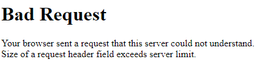
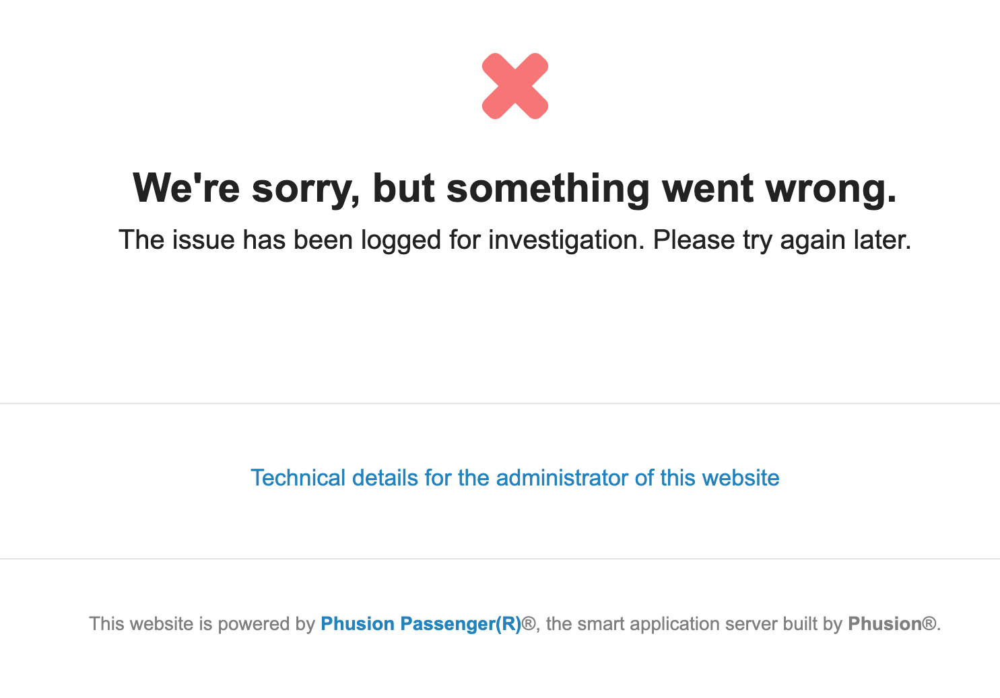

# Open OnDemand Issues

<link rel="stylesheet" href="../../../assets/stylesheets/animated_dropdown.css">
<link rel="stylesheet" href="../../../assets/stylesheets/spacing.css">

<html>
    
<button class="collapsible">Why am I getting a message saying I'm not sponsored when trying to log in?</button>

  

      If you are trying to log in to Open Ondemand and are seeing the following:
      
      <ul>
          <li>You have not yet been sponsored by a faculty member. See our <a href="../../../registration_and_access/account_creation/">Account Creation</a> page for instructions on getting registered for HPC.</li>
          <li>If you are already registered for HPC, this may be a browser issue. Try logging in again in an incognito session or different browser to test. If this succeeds, clearing your browser's cookies should help.</li>
      </ul>
  

<button class="collapsible">Why am I getting a "Bad Request" message when trying to connect?</button>

  

      If you are trying to log in to Open Ondemand and are seeing the following:
       
      
       
      this may be a browser issue. Try logging in again in an incognito session or different browser to test. If this succeeds, clearing your browser's cache should help.
  

<button class="collapsible">Why am I getting an error saying "We're sorry, but something went wrong" when trying to log in?</button>

  

      If you are trying to log in to Open Ondemand and are seeing the following:
       
      
       
      check your storage usage in your home directory. You can do this by logging into HPC in a terminal session and using the command <code>uquota</code>. If your storage usage is >50 GB, OnDemand cannot create the temporary files necessary to give access to the website. Try clearing out some space in your home and then logging back into OnDemand.
  

<button class="collapsible">Why are my Desktop sessions failing with 'Could not connect to session bus: failed to connect to socket /tmp/dbus-'?</button>

  

      If you're seeing:
       
      
       
      when trying to connect to an interactive desktop session, the likely culprit is Anaconda. For a permanent solution, you can run the following command from an interactive terminal session:
      <pre><code>
conda config --set auto_activate_base false
      </code></pre>
      This will prevent conda from auto-activating when you first log in and allow you to have more control over your environment. When you'd like to activate Anaconda, run <code>conda activate</code>. 
  

    
    

</html>
