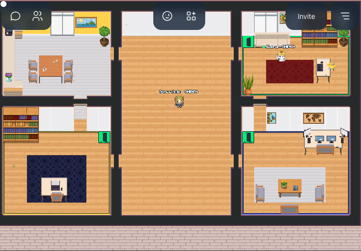

# Office Hours

<link rel="stylesheet" href="../../../assets/stylesheets/images.css">

!!! info "Office Hours Platform Change"
    Due to a change in Gather Town policy, as of September 15th, 2025 we have transitioned to using WorkAdventure for our office hours services. The new link is provided below. 

<html>
<a href="https://workadventure.tra220030.projects.jetstream-cloud.org/_/global/saramwillis.github.io/office-hours/office.tmj" title="Click here to join our office hours workspace" class="md-button">Join Us in Office Hours</a>
</html>

We host virtual, drop-in office hours every Wednesday from 2:00-4:00pm. Drop by to visit with our consultants to ask any questions you have about using HPC resources. It might be a bunch of getting started questions, or you might want to share your screen to walk us through a particular problem you're hung up on. We have private spaces for one-on-one consults. You can [join us in WorkAdventure at this link](https://workadventure.tra220030.projects.jetstream-cloud.org/_/global/saramwillis.github.io/office-hours/office.tmj). 

If you have never used WorkAdventure before and would like additional information, [check out this page](https://workadventu.re/).