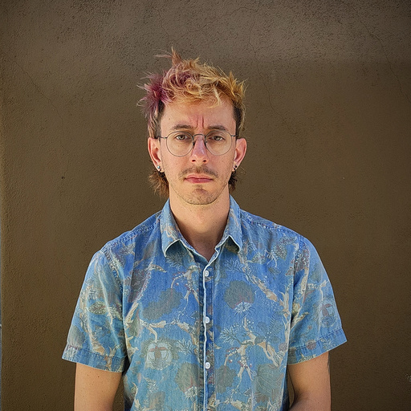
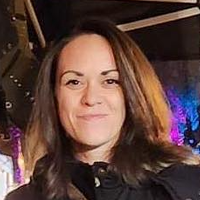
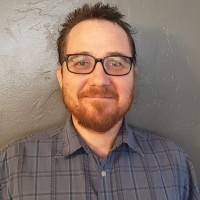
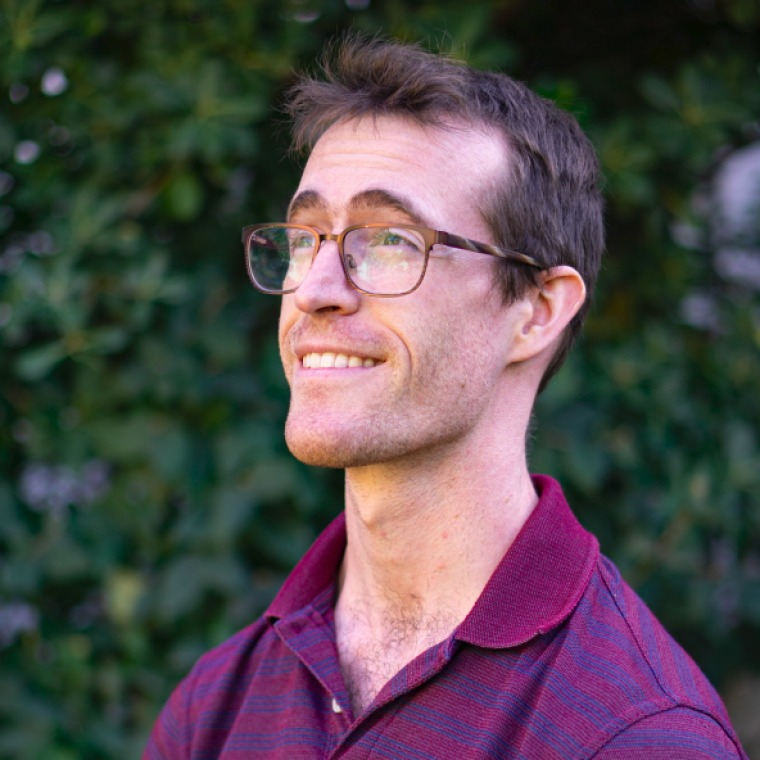

<meta name="viewport" content="width=device-width, initial-scale=1.0">
<link rel="stylesheet" href="/assets/stylesheets/people.css">

# Research Computing Support Staff

Welcome to our Support Staff page, where you can get acquainted with the individuals who make up our HPC consulting team.

## Research Computing Facilitation Manager

  

    
    

      <h4><b>Chris Reidy</b></h4>

      
Chris Reidy is a dedicated academic professional currently serving at the University of Arizona, where he has distinguished himself through his expertise and passion for his field. With a background in education and administration, Reidy has contributed significantly to the university community, demonstrating a commitment to fostering learning environments conducive to student success. Known for his collaborative spirit and innovative approach to challenges, he has played a pivotal role in various educational initiatives and administrative endeavors within the university. Reidy's dedication to excellence and his unwavering support for both students and colleagues alike make him an invaluable asset to the University of Arizona community. And by the way, ChatGPT wrote this for me.

    

  

## HPC Consulting

  

    
    

      <h4><b>Ethan Jahn</b></h4>

      
Ethan has been a scientific programmer for over 10 years, and a user of High Performance Computing resources for over 7 years. They earned their PhD in Computational Astrophysics from UC Riverside in 2021, and spent two years as an Adjunct Professor of Physics at Riverside City College before joining the UA HPC team in August 2023. They continue to incorporate education, training, and outreach into their consulting practice, and have an interest in interdisciplinary approaches to science communication.

    

  

  

    
    

      <h4><b>Soham Pal</b></h4>

      
Fooing baz

    

  

  

    
    

      <h4><b>Sara Willis</b></h4>

      
Sara Willis is originally from the San Francisco Bay Area and graduated from The University of Arizona with a double major in math and physics. Following graduation, she transitioned to a role as a bioinformatician performing research in protein evolution. Finding she was weirdly passionate about software installations, writing and optimizing code, and debugging, she joined the HPC consulting team in 2019 to assist researchers with their computation.

    

  

  

    
    

      <h4><b>Derrick Zwickl</b></h4>

      
Derrick has worked with HPC resources for nearly 25 years as a researcher, software developer and support staff.  He  joined the UArizona HPC consulting team in early 2022.  Derrick is originally from Tucson, and was an undergraduate at  the University of Arizona.  He obtained a Ph.D. in Evolutional Biology from the University of Texas, developing  software for the estimation of evolutionary trees from DNA sequences. 

    

  

## Visualization Consulting

  

    
    

      <h4><b>Devin Bayly</b></h4>

      
I'm a member of the Research Technologies Data & Visualization team at the University of Arizona. I work with researchers, students and faculty to bring your data to life through drop ins, 1:1 consultations, collaborative projects both short & long term, and general protocols enhancing the visualization offerings of our High Performance Computing (HPC).

    

  

