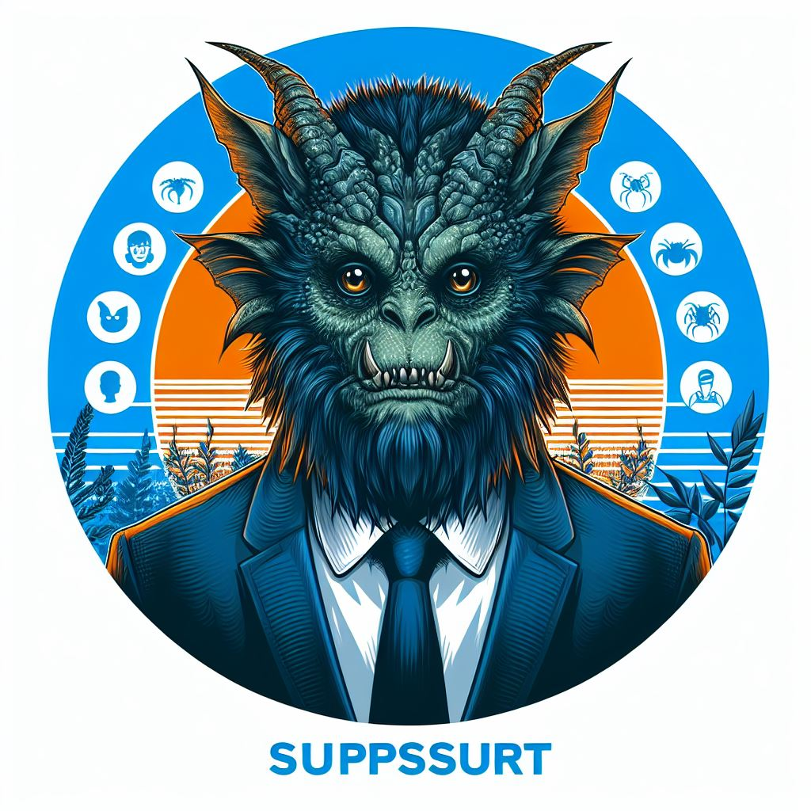
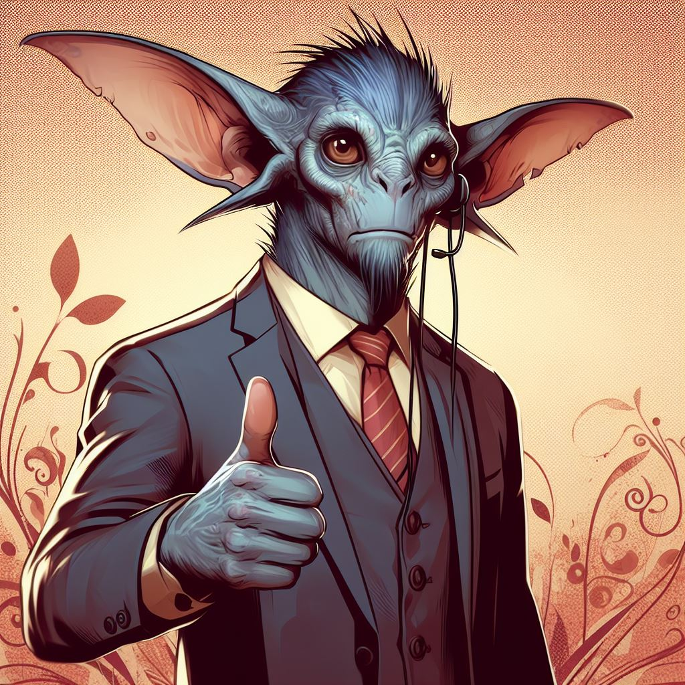

# Research Computing Support Staff

Welcome to our Support Staff page, where you can get acquainted with the individuals who make up our HPC consulting team.

## Research Computing Facilitation Manager

-   

    
**Chris Reidy**

    ---

    Foo bar baz

## HPC Consulting

-   

    
**Ethan Jahn**

    ---

    barring foo

-   

    
**Soham Pal**

    ---

    fooing baz

-   

    
**Sara Willis**

    ---

    burble burble 

-   

    
**Derrick Zwickl**

    ---

    meep snarf

## Visualization Consulting

-   

    
**Devin Bayly**

    ---

    Bazzing foo

